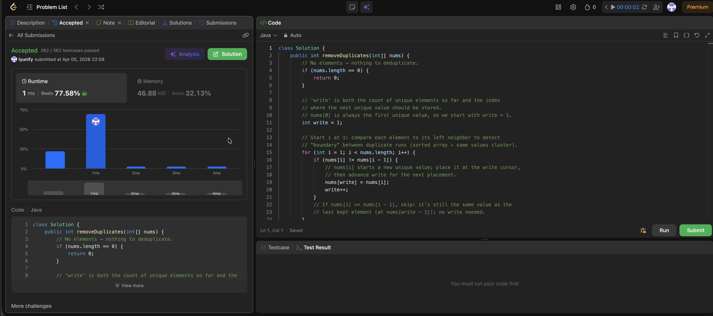

# 26. Remove Duplicates from Sorted Array

**Difficulty**: Easy<br>
**Primary Tag**: array<br>
**Secondary Tags**: two-pointers<br>
**LeetCode Link**: https://leetcode.com/problems/remove-duplicates-from-sorted-array/

---

## Problem Summary

Given a non-decreasing integer array `nums`, remove duplicates **in-place** so each unique value appears once. Return `k`, the count of unique elements. The first `k` elements of `nums` must hold the unique values in order.

## Screenshot



---

## My Mistake(s)

- Reached for a second array or HashSet to track "seen" values — broke the O(1) extra space requirement and ignored that sorting already clusters duplicates.
- Confused "index of the last kept element" with "count k": used `write` as the last index and returned `write + 1`, or forgot `write` is already the length of the valid prefix and returned it one step too early/late.
- Tried comparing `nums[i]` with `nums[write - 1]` without clear invariants; when `i` is only one step ahead, comparing `nums[i]` vs `nums[i - 1]` is simpler because sorted order guarantees duplicates are adjacent.
- Edge cases: empty array (`length == 0` → return `0`); single element (loop does nothing → correctly return `1`). Nearly missed the empty case.
- Briefly worried about overwriting before reading — with this scan order, `write <= i` always holds, so we never clobber data still needed.

## Key Insight

- Because the array is non-decreasing, each distinct value forms a contiguous run. A single forward scan suffices: whenever `nums[i] != nums[i - 1]`, we've hit the start of a new unique value and copy it to `nums[write++]`.
- This is the classic **in-place dedup / slow–fast pointer** pattern on sorted data: `write` is simultaneously the size of the valid prefix and the next slot to fill — no extra structure required.
- Return value = `write` after the loop: it is exactly `k`, the number of unique elements. Keeping this invariant clear eliminates all off-by-one bugs.

## Correct Approach

Guard for empty input, then walk `i` from `1` to `n-1`. Copy `nums[i]` into `nums[write]` and advance `write` only when a new unique value is detected (`nums[i] != nums[i-1]`).

```java
class Solution {
    public int removeDuplicates(int[] nums) {
        // No elements → nothing to deduplicate.
        if (nums.length == 0) {
            return 0;
        }

        // 'write' is both the count of unique elements so far and the index
        // where the next unique value should be stored.
        // nums[0] is always the first unique value, so we start with write = 1.
        int write = 1;

        // Start i at 1: compare each element to its left neighbor to detect
        // the "boundary" between duplicate runs (sorted → same values cluster).
        for (int i = 1; i < nums.length; i++) {
            if (nums[i] != nums[i - 1]) {
                // nums[i] starts a new unique value; place it at the write cursor,
                // then advance write for the next placement.
                nums[write] = nums[i];
                write++;
            }
            // If nums[i] == nums[i - 1], skip: still the same value as the
            // last kept element (at nums[write - 1]); no write needed.
        }

        // write == number of unique elements == k.
        return write;
    }
}
```

**Time Complexity**: O(n)<br>
**Space Complexity**: O(1) — in-place, no extra structure

---

## Practice History

| Date | Outcome | Notes |
|------|---------|-------|
| 2026-03-25 | ✅ Solved after review | Off-by-one on write pointer; slow–fast invariant and empty-array edge case clicked during review |
| 2026-04-05 | ✅ Solved after review | HashSet by habit, off-by-one on write init/return, comparing to nums[write-1] instead of nums[i-1], O(n²) shifting instinct, worrying about tail values past k |
