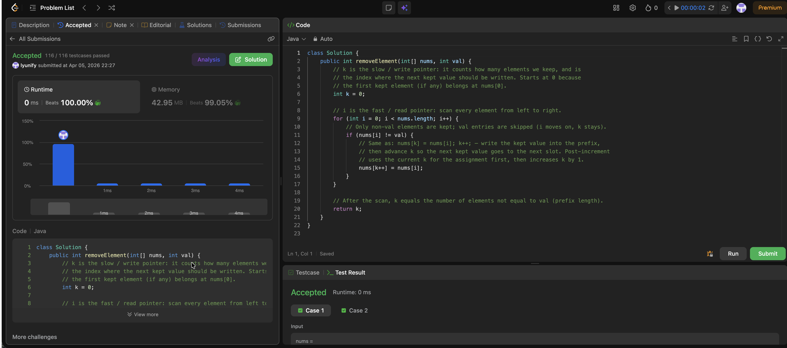

# 27. Remove Element

**Difficulty**: Easy<br>
**Primary Tag**: array<br>
**Secondary Tags**: two-pointers<br>
**LeetCode Link**: https://leetcode.com/problems/remove-element/

---

## Problem Summary

Given an integer array `nums` and an integer `val`, remove all occurrences of `val` in-place and return the count of remaining elements.

## Screenshot



---

## My Mistake(s)

- Confused Javadoc comments (`/** … */`) with Java annotations (`@Override`, etc.).
- Mixed up array index `i` with the value at `nums[i]` (e.g. "i moved to 2" when `i` was actually 1 and the value was 2).
- Thought slow `k` and fast `i` "both sit at index 1" after a round, and forgot the `for` loop's `i++` at the end — after finishing the `i == 1` iteration, `i` becomes 2, not 1.
- Imagined "holes" or empty slots after deletion; in this problem we only overwrite — e.g. when `i == 1`, `nums[k++] = nums[i]` (with `k == 0`) is exactly the line that writes 2 onto `nums[0]`.
- Was unsure how post-increment `k++` in `nums[k++] = nums[i]` works: use current `k` for the assignment, then increment `k`.

## Key Insight

- `i` = read / fast pointer (every cell is visited once). `k` = write / slow pointer = length of the valid prefix so far and next index to write; it only moves when we keep an element.
- "Remove in-place" here means shift kept values to the front by assignment, not leaving empty indices; `nums[0..k-1]` is the answer prefix, return `k` is the count.

## Correct Approach

Use two pointers: `i` scans every element; `k` tracks the write position. Whenever `nums[i] != val`, copy it to `nums[k]` and advance `k`. After the loop, `k` equals the number of kept elements.

```java
class Solution {
    public int removeElement(int[] nums, int val) {
        int k = 0;
        for (int i = 0; i < nums.length; i++) {
            if (nums[i] != val) {
                nums[k++] = nums[i];
            }
        }
        return k;
    }
}
```

**Time Complexity**: O(n)<br>
**Space Complexity**: O(1)

---

## Practice History

| Date | Outcome | Notes |
|------|---------|-------|
| 2026-03-24 | ✅ Solved after review | Confused index vs value, forgot for-loop increment, misunderstood post-increment k++ |
| 2026-04-05 | ✅ Solved after review | Shrinking from left (O(n²)), extra array by habit, wrong return value, off-by-one on write pointer, overthinking tail cleanup, confused order-agnostic with two-pointer swap approach |
