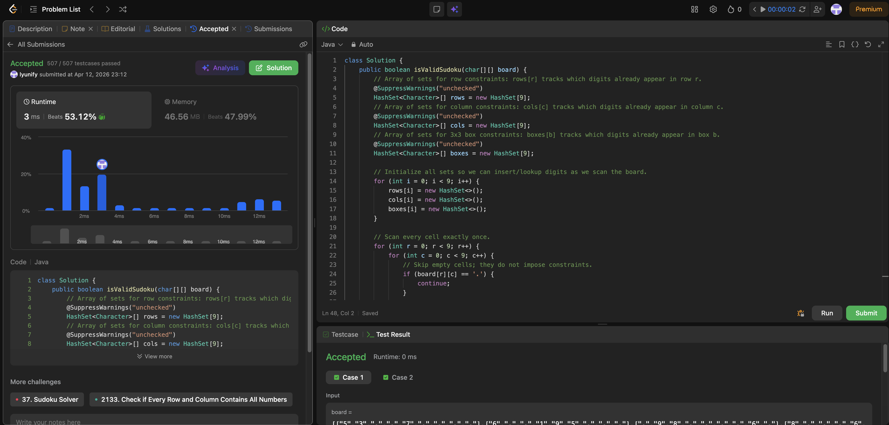

# 36. Valid Sudoku

**Difficulty**: Medium<br>
**Primary Tag**: array<br>
**Secondary Tags**: hash-table, matrix<br>
**LeetCode Link**: https://leetcode.com/problems/valid-sudoku/

---

## Problem Summary

Determine if a 9×9 Sudoku board is valid by checking that each row, column, and 3×3 sub-box contains no duplicate digits (ignoring empty cells `'.'`).

## Screenshot



---

## My Mistake(s)

- Mixing up the box index formula — must be `(r / 3) * 3 + (c / 3)` (integer division); using `r * 3 + c` or similar causes wrong cell groupings.
- Forgetting to skip `'.'` and treating it as a digit, creating false duplicates.
- Only checking rows and columns but forgetting the 3×3 sub-box constraint entirely.
- Accidentally reusing the same `HashSet` instance for multiple rows/cols/boxes due to incorrect initialization (must initialize 9 separate sets for each array).
- Assuming the board must be solvable; the task only validates currently filled cells, not whether a solution exists.

## Key Insight

A valid Sudoku check enforces three independent "no-duplicates" constraints: row, column, and 3×3 box. Scan each cell once, maintaining three arrays of 9 sets keyed by row index, column index, and box index. The box index formula `(r / 3) * 3 + (c / 3)` maps all 81 cells into one of 9 boxes (0–8). If any digit already appears in the relevant row, column, or box set, return false; otherwise record it. This is O(81) = O(1) time and O(1) extra space (bounded by the fixed board size).

## Correct Approach

1. Initialize `rows[9]`, `cols[9]`, `boxes[9]`, each holding a fresh `HashSet<Character>`.
2. Iterate every cell `(r, c)`. Skip if `board[r][c] == '.'`.
3. Compute `boxIndex = (r / 3) * 3 + (c / 3)`.
4. If `rows[r]`, `cols[c]`, or `boxes[boxIndex]` already contains the digit → return `false`.
5. Otherwise add the digit to all three sets.
6. Return `true` after scanning all cells.

```java
class Solution {
    public boolean isValidSudoku(char[][] board) {
        HashSet<Character>[] rows  = new HashSet[9];
        HashSet<Character>[] cols  = new HashSet[9];
        HashSet<Character>[] boxes = new HashSet[9];

        for (int i = 0; i < 9; i++) {
            rows[i]  = new HashSet<>();
            cols[i]  = new HashSet<>();
            boxes[i] = new HashSet<>();
        }

        for (int r = 0; r < 9; r++) {
            for (int c = 0; c < 9; c++) {
                if (board[r][c] == '.') continue;

                char d = board[r][c];
                int boxIndex = (r / 3) * 3 + (c / 3);

                if (!rows[r].add(d) || !cols[c].add(d) || !boxes[boxIndex].add(d)) {
                    return false;
                }
            }
        }

        return true;
    }
}
```

**Time Complexity**: O(1) (fixed 81-cell board)<br>
**Space Complexity**: O(1) (fixed-size sets)

---

## Practice History

| Date | Outcome | Notes |
|------|---------|-------|
| 2026-04-12 | ✅ Solved after review | Wrong box index formula; forgot to skip '.'; missed sub-box constraint; reused same set instance |
