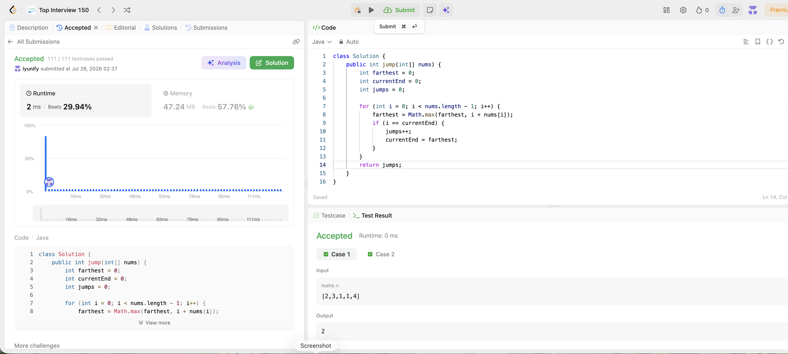

# 45. Jump Game II

**Difficulty**: Medium<br>
**Primary Tag**: array<br>
**Secondary Tags**: greedy, dynamic-programming<br>
**LeetCode Link**: https://leetcode.com/problems/jump-game-ii/

---

## Problem Summary

Given an integer array `nums` where `nums[i]` is the maximum jump length from index `i`, return the minimum number of jumps to reach the last index. It is guaranteed you can always reach the end.

## Screenshot



---

## My Mistake(s)

- **Confusing with Jump Game I**: Returning true/false instead of a count; reusing the `lastPosition` right-to-left approach which doesn't track jump count.
- **BFS overkill**: Modeling as BFS level-by-level is correct but O(n²) in the worst case; the greedy approach achieves O(n).
- **Miscounting jumps**: Incrementing `jumps` at every step rather than only when the current "window" is exhausted; this overcounts.
- **Wrong loop bound**: Looping to `nums.length` (inclusive of last index) causes an extra jump count — you stop scanning before the last index since you never need to jump from it.
- **Not tracking two boundaries**: Need both `currentEnd` (end of current jump's reach) and `farthest` (best reach seen within the window); conflating them leads to premature or delayed jump increments.

## Key Insight

- **Greedy window**: Treat each jump as a "level" (like BFS). Within the current window `[prev_end+1 .. currentEnd]`, scan all positions and track `farthest = max(i + nums[i])`. When `i` hits `currentEnd`, you must jump — increment `jumps` and extend the window to `farthest`.
- **Loop stops at `n - 2`**: Never need to jump from the last index, so stop one short. This prevents an extra `jumps++` when `currentEnd` coincidentally equals the last index on the final window.
- **O(n)/O(1)**: One pass, three variables — no extra array, no BFS queue.

## Correct Approach

1. Initialize `farthest = 0`, `currentEnd = 0`, `jumps = 0`.
2. For `i` from `0` to `n - 2`:
   - Update `farthest = max(farthest, i + nums[i])`.
   - If `i == currentEnd`: `jumps++`, `currentEnd = farthest`.
3. Return `jumps`.

```java
class Solution {
    public int jump(int[] nums) {
        int farthest = 0;
        int currentEnd = 0;
        int jumps = 0;

        for (int i = 0; i < nums.length - 1; i++) {
            farthest = Math.max(farthest, i + nums[i]);
            if (i == currentEnd) {
                jumps++;
                currentEnd = farthest;
            }
        }

        return jumps;
    }
}
```

**Time Complexity**: O(n)<br>
**Space Complexity**: O(1)

---

## Practice History

| Date | Outcome | Notes |
|------|---------|-------|
| 2026-07-28 | ✅ Accepted | 2 ms, beats 29.94% — greedy window with farthest + currentEnd; loop to n-2 to avoid extra jump |
