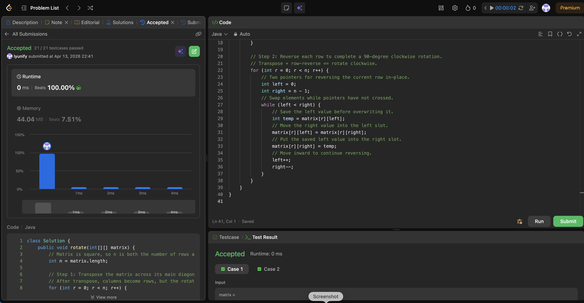

# 48. Rotate Image

**Difficulty**: Medium<br>
**Primary Tag**: array<br>
**Secondary Tags**: matrix, math<br>
**LeetCode Link**: https://leetcode.com/problems/rotate-image/

---

## Problem Summary

Given an `n x n` 2D matrix, rotate it 90° clockwise **in-place**.

## Screenshot



---

## My Mistake(s)

- Doing operations in the wrong order (e.g., reversing columns instead of rows after transpose), which rotates counterclockwise or produces a mirrored matrix.
- Starting the inner transpose loop at index 0 instead of `r + 1`, causing each pair to be swapped twice and cancel out (net no-op).
- Off-by-one bugs when reversing a row (wrong loop condition or pointer updates).
- Confusing "flip vertically then transpose" vs "transpose then reverse rows" and mixing the two inconsistently.
- Forgetting the problem requires in-place modification and allocating a new matrix instead.

## Key Insight

A 90° clockwise rotation decomposes into two simple in-place operations:
1. **Transpose** across the main diagonal: swap `matrix[r][c]` with `matrix[c][r]` for all `c > r`.
2. **Reverse each row**: swap elements from both ends toward the center.

Transpose maps `(r, c)` → `(c, r)`, and reversing rows then completes the clockwise direction. Both steps are O(n²) time and O(1) extra space, avoiding complex direct index mappings.

## Correct Approach

```java
class Solution {
    public void rotate(int[][] matrix) {
        int n = matrix.length;

        // Step 1: Transpose across the main diagonal.
        // Inner loop starts at r+1 to avoid swapping pairs twice.
        for (int r = 0; r < n; r++) {
            for (int c = r + 1; c < n; c++) {
                int temp = matrix[r][c];
                matrix[r][c] = matrix[c][r];
                matrix[c][r] = temp;
            }
        }

        // Step 2: Reverse each row to complete 90° clockwise rotation.
        for (int r = 0; r < n; r++) {
            int left = 0, right = n - 1;
            while (left < right) {
                int temp = matrix[r][left];
                matrix[r][left] = matrix[r][right];
                matrix[r][right] = temp;
                left++;
                right--;
            }
        }
    }
}
```

**Time Complexity**: O(n²)<br>
**Space Complexity**: O(1)

---

## Practice History

| Date | Outcome | Notes |
|------|---------|-------|
| 2026-04-13 | ✅ Solved after review | Recalled transpose + reverse-row decomposition; key trap is inner loop starting at r+1 |
