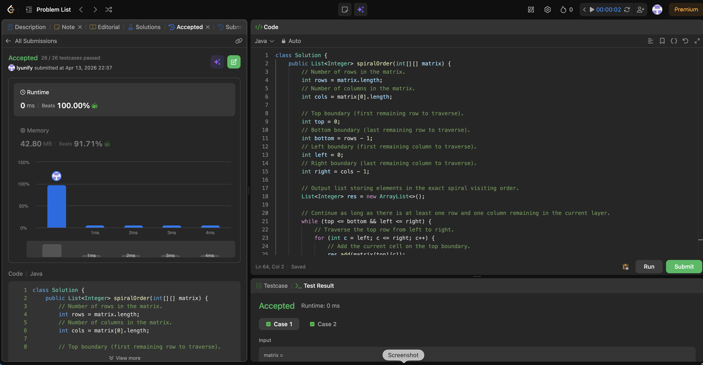

# 54. Spiral Matrix

**Difficulty**: Medium<br>
**Primary Tag**: array<br>
**Secondary Tags**: matrix, simulation<br>
**LeetCode Link**: https://leetcode.com/problems/spiral-matrix/

---

## Problem Summary

Given an `m x n` matrix, return all elements of the matrix in spiral order (clockwise, starting from the top-left).

## Screenshot



---

## My Mistake(s)

- Marking visited cells by overwriting the matrix (sentinel approach) is risky if constraints change or if the sentinel might collide with valid values; boundary simulation avoids mutation entirely.
- Forgetting the two guard checks (`top <= bottom` and `left <= right`) inside the loop leads to duplicates when the remaining region collapses to a single row or column.
- Off-by-one errors in loop ranges (using `<` instead of `<=`, or shrinking boundaries in the wrong order).
- Mixing up row/column indices when traversing (e.g., writing `matrix[c][r]` instead of `matrix[r][c]`).
- Shrinking a boundary too early (before finishing its corresponding traversal), which skips elements.

## Key Insight

Spiral order can be simulated by maintaining four shrinking boundaries: `top`, `bottom`, `left`, `right`. In each layer, traverse:
1. Top row left → right, then shrink `top++`
2. Right column top → bottom, then shrink `right--`
3. Bottom row right → left (guarded by `top <= bottom`), then shrink `bottom--`
4. Left column bottom → top (guarded by `left <= right`), then shrink `left++`

The two guards prevent duplicating elements when the remaining region collapses to a single row or column. This is O(mn) time and O(1) extra space besides the output.

## Correct Approach

Initialize four boundary pointers. While the boundaries haven't crossed, traverse the four sides in order and shrink each boundary immediately after its traversal. Guard the third and fourth traversals to handle single-row or single-column remainders.

```java
class Solution {
    public List<Integer> spiralOrder(int[][] matrix) {
        int rows = matrix.length;
        int cols = matrix[0].length;

        int top = 0, bottom = rows - 1;
        int left = 0, right = cols - 1;

        List<Integer> res = new ArrayList<>();

        while (top <= bottom && left <= right) {
            // Traverse top row left → right
            for (int c = left; c <= right; c++) res.add(matrix[top][c]);
            top++;

            // Traverse right column top → bottom
            for (int r = top; r <= bottom; r++) res.add(matrix[r][right]);
            right--;

            // Traverse bottom row right → left (guard: still have rows)
            if (top <= bottom) {
                for (int c = right; c >= left; c--) res.add(matrix[bottom][c]);
                bottom--;
            }

            // Traverse left column bottom → top (guard: still have cols)
            if (left <= right) {
                for (int r = bottom; r >= top; r--) res.add(matrix[r][left]);
                left++;
            }
        }

        return res;
    }
}
```

**Time Complexity**: O(m × n)<br>
**Space Complexity**: O(1) extra space (output list excluded)

---

## Practice History

| Date | Outcome | Notes |
|------|---------|-------|
| 2026-04-13 | ✅ Solved after review | Boundary simulation; needed to recall the two inner guards for single-row/column collapse |
