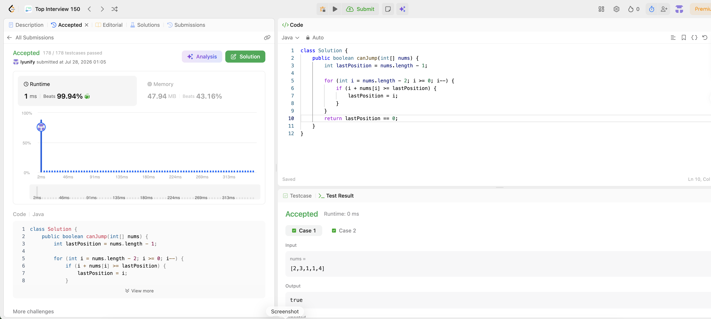

# 55. Jump Game

**Difficulty**: Medium<br>
**Primary Tag**: array<br>
**Secondary Tags**: greedy, dynamic-programming<br>
**LeetCode Link**: https://leetcode.com/problems/jump-game/

---

## Problem Summary

Given an integer array `nums` where `nums[i]` is the maximum jump length from index `i`, return `true` if you can reach the last index starting from index 0, otherwise return `false`.

## Screenshot



---

## My Mistake(s)

- **Defaulting to BFS/DFS**: Modeling as a graph and exploring reachable nodes is correct but O(n²) in the worst case; the greedy insight removes the need for explicit traversal.
- **Confusing max-reach with reachability**: Tracking the globally maximum index reachable so far is sufficient — you don't need to simulate each jump individually.
- **Wrong loop bound**: Starting from `nums.length - 1` and going right-to-left (or wrong direction) misses the greedy sweep logic.
- **Off-by-one on last index**: The target is `nums.length - 1`; fencepost errors on `>` vs `>=` cause wrong answers on single-element arrays or tight inputs.

## Key Insight

- **Right-to-left greedy (lastPosition)**: Walk from second-to-last index down to 0. If `i + nums[i] >= lastPosition`, then index `i` can reach the current goal — update `lastPosition = i`. At the end, if `lastPosition == 0`, index 0 can reach the end.
- **Left-to-right greedy (maxReach)**: Maintain `maxReach = max(maxReach, i + nums[i])` while `i <= maxReach`; if `maxReach >= n-1` return true. Both are O(n)/O(1).
- **Why greedy is correct**: A zero only blocks you if nothing before it gave enough reach to skip over it. Tracking the leftmost "goal" position (or rightmost reachable position) captures this in one pass.

## Correct Approach

Right-to-left: initialize `lastPosition = n - 1`. For `i` from `n - 2` down to `0`, if `i + nums[i] >= lastPosition` update `lastPosition = i`. Return `lastPosition == 0`.

```java
class Solution {
    public boolean canJump(int[] nums) {
        int lastPosition = nums.length - 1;

        for (int i = nums.length - 2; i >= 0; i--) {
            if (i + nums[i] >= lastPosition) {
                lastPosition = i;
            }
        }

        return lastPosition == 0;
    }
}
```

**Time Complexity**: O(n)<br>
**Space Complexity**: O(1)

---

## Practice History

| Date | Outcome | Notes |
|------|---------|-------|
| 2026-07-28 | ✅ Accepted | 1 ms, beats 99.94% — right-to-left greedy, tracking lastPosition |
| 2026-07-28 | ✅ Accepted | 1 ms, beats 99.94% — same approach, second run to confirm |
