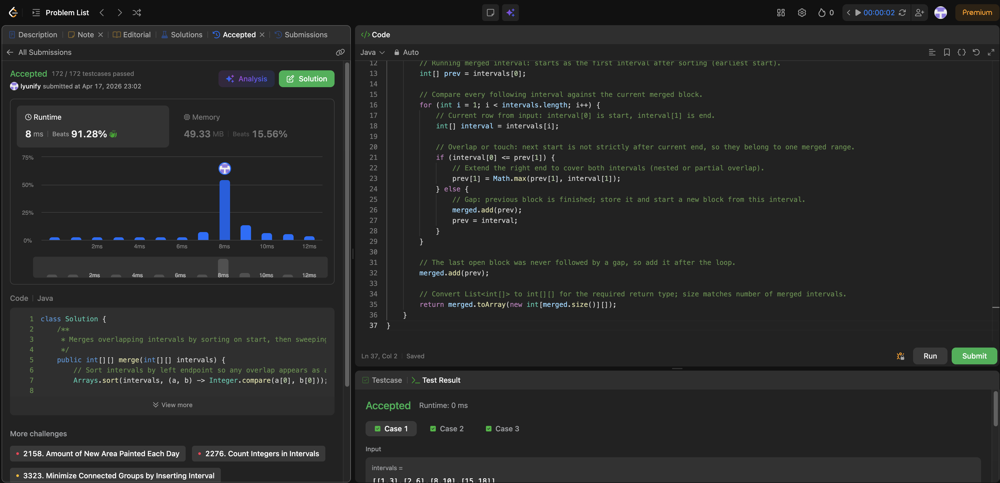

# 56. Merge Intervals

**Difficulty**: Medium<br>
**Primary Tag**: array<br>
**Secondary Tags**: sorting<br>
**LeetCode Link**: https://leetcode.com/problems/merge-intervals/

---

## Problem Summary

Given an array of intervals, merge all overlapping intervals and return an array of the non-overlapping intervals that cover all the input intervals exactly.

## Screenshot



---

## My Mistake(s)

- Using `interval[0] < prev[1]` instead of `<=`, which breaks when intervals only touch at a single point (e.g. `[1,4]` and `[4,5]` should merge to `[1,5]`).
- Forgetting `Math.max` on the right end when one interval fully contains another (e.g. `[1,10]` and `[2,3]` should keep end as `10`, not `3`).
- Skipping the sort and trying pairwise merge in arbitrary order—only works after sorting by left endpoint.
- Forgetting the final `merged.add(prev)` after the loop; the last open block is never followed by a gap that triggers an add.
- Mixing up row indices `interval[0]` vs `interval[1]` when tired.

## Key Insight

Sorting by left endpoint turns the problem into a single left-to-right sweep: the only interval that can merge with the current block is the next one in sorted order. Overlap (including touching) is `nextStart <= currentEnd`; the merged end is `max(currentEnd, nextEnd)`. Carrying `prev` as the in-progress interval avoids building temporary objects until a gap appears—then `prev` is finalized and reset to the new interval.

## Correct Approach

1. Sort `intervals` by left endpoint: `Arrays.sort(intervals, (a, b) -> Integer.compare(a[0], b[0]))`.
2. Initialize `prev = intervals[0]`.
3. Loop `i` from `1` to `intervals.length - 1`:
   - If `intervals[i][0] <= prev[1]` → overlap/touch: extend `prev[1] = Math.max(prev[1], intervals[i][1])`.
   - Else → gap: `merged.add(prev)`, then `prev = intervals[i]`.
4. After the loop, `merged.add(prev)` to capture the last block.
5. Return `merged.toArray(new int[merged.size()][])`.

```java
public int[][] merge(int[][] intervals) {
    Arrays.sort(intervals, (a, b) -> Integer.compare(a[0], b[0]));
    List<int[]> merged = new ArrayList<>();
    int[] prev = intervals[0];
    for (int i = 1; i < intervals.length; i++) {
        int[] interval = intervals[i];
        if (interval[0] <= prev[1]) {
            prev[1] = Math.max(prev[1], interval[1]);
        } else {
            merged.add(prev);
            prev = interval;
        }
    }
    merged.add(prev);
    return merged.toArray(new int[merged.size()][]);
}
```

**Time Complexity**: O(n log n)<br>
**Space Complexity**: O(n)

---

## Practice History

| Date | Outcome | Notes |
|------|---------|-------|
| 2026-04-17 | ✅ | Solved after review. Key trips: `<=` for touching intervals, `Math.max` for nested intervals, and remembering `merged.add(prev)` after the loop. |
