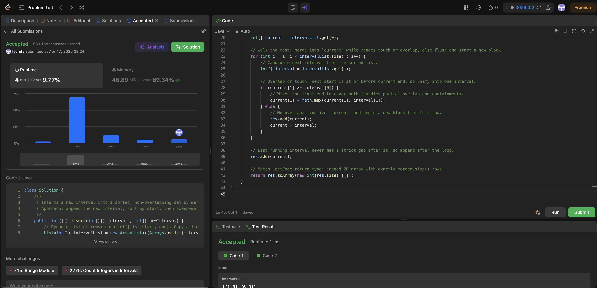

# 57. Insert Interval

**Difficulty**: Medium<br>
**Primary Tag**: array<br>
**Secondary Tags**: sorting<br>
**LeetCode Link**: https://leetcode.com/problems/insert-interval/

---

## Problem Summary

Given a sorted, non-overlapping list of intervals and a new interval, insert the new interval and merge any overlapping intervals, returning the resulting sorted, non-overlapping list.

## Screenshot



---

## My Mistake(s)

- Using strict `<` instead of `<=` for overlap, so touching endpoints like `[1,5]` and `[5,7]` fail to merge.
- Forgetting `res.add(current)` after the loop—the last running interval is never finalized by a gap condition.
- Off-by-one in loop bounds when attempting a linear three-pass insert without sorting.
- Confusing `Arrays.asList(intervals)` behavior—it wraps each `int[]` row as one element (correct here), not a flat list of ints.

## Key Insight

Inserting one interval into a sorted disjoint list is identical to Merge Intervals once you add `newInterval` to the list and sort by start. The sweep carries a `current` running block: while `current[1] >= nextStart` (overlap or touch), extend `current[1] = Math.max(current[1], nextEnd)`; otherwise flush `current` and start fresh. A linear O(n) three-pass (copy left / merge middle / copy right) avoids the sort, but sort + merge is easier to implement correctly under time pressure and shares the same pattern as problem 56.

## Correct Approach

1. Build a mutable list from `intervals`, add `newInterval`, sort by start.
2. Initialize `current = list.get(0)`.
3. Loop from index 1: if `current[1] >= interval[0]` → extend `current[1] = Math.max(current[1], interval[1])`; else → `res.add(current)`, `current = interval`.
4. After loop: `res.add(current)`.
5. Return `res.toArray(new int[res.size()][])`.

```java
public int[][] insert(int[][] intervals, int[] newInterval) {
    List<int[]> intervalList = new ArrayList<>(Arrays.asList(intervals));
    intervalList.add(newInterval);
    intervalList.sort((a, b) -> Integer.compare(a[0], b[0]));

    List<int[]> res = new ArrayList<>();
    int[] current = intervalList.get(0);

    for (int i = 1; i < intervalList.size(); i++) {
        int[] interval = intervalList.get(i);
        if (current[1] >= interval[0]) {
            current[1] = Math.max(current[1], interval[1]);
        } else {
            res.add(current);
            current = interval;
        }
    }
    res.add(current);
    return res.toArray(new int[res.size()][]);
}
```

**Time Complexity**: O(n log n)<br>
**Space Complexity**: O(n)

---

## Practice History

| Date | Outcome | Notes |
|------|---------|-------|
| 2026-04-18 | ✅ | Solved after review. Tripped on `<=` vs `<` for touching intervals and forgetting `res.add(current)` after the loop. |
