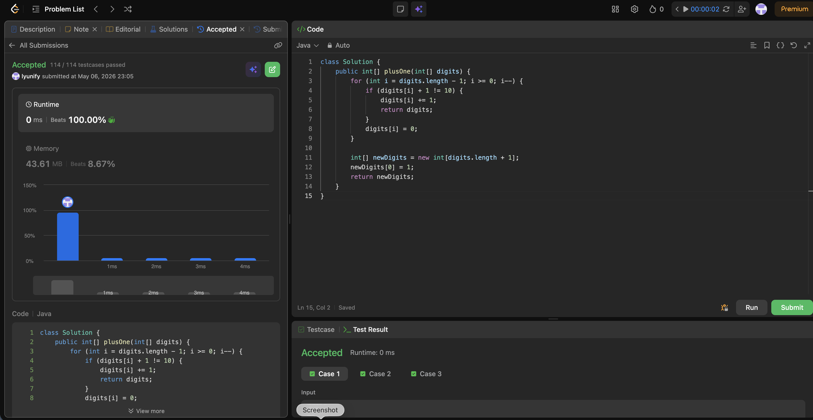

# 66. Plus One

**Difficulty**: Easy<br>
**Primary Tag**: array<br>
**Secondary Tags**: math<br>
**LeetCode Link**: https://leetcode.com/problems/plus-one/

---

## Problem Summary

Given a non-empty array of digits representing a non-negative integer, increment the integer by one and return the result as an array of digits.

## Screenshot



---

## My Mistake(s)

- Overcomplicating with full number conversion (e.g., to int/long) can overflow and is unnecessary; the array simulation is safer.
- Forgetting the all-9s case (like [9,9,9]) leads to wrong length/result if you only mutate in place.
- Off-by-one errors are easy here if you don't start from `digits.length - 1` and move left consistently.

## Key Insight

- Handle the addition from right to left so carry logic is natural and localized.
- Early return is the cleanest optimization: as soon as you increment a non-9 digit, the rest of the number is unchanged.
- The only time you need a new array is when every digit is 9; then the answer is 1 followed by zeros.

## Correct Approach

1. Iterate from the last index to 0.
2. If `digits[i] + 1 != 10`, increment and return immediately — no carry to propagate.
3. Otherwise set `digits[i] = 0` and continue (carry propagates left).
4. If the loop completes, all digits were 9. Return a new array of length `n + 1` with `newDigits[0] = 1` (rest default to 0).

```java
class Solution {
    public int[] plusOne(int[] digits) {
        for (int i = digits.length - 1; i >= 0; i--) {
            if (digits[i] + 1 != 10) {
                digits[i] += 1;
                return digits;
            }
            digits[i] = 0;
        }
        int[] newDigits = new int[digits.length + 1];
        newDigits[0] = 1;
        return newDigits;
    }
}
```

**Time Complexity**: O(n)<br>
**Space Complexity**: O(1) typical, O(n) only for the all-9s case

---

## Practice History

| Date | Outcome | Notes |
|------|---------|-------|
| 2026-05-06 | ✅ (solved after review) | Right-to-left carry; early return on non-9; new array only for all-9s input |
