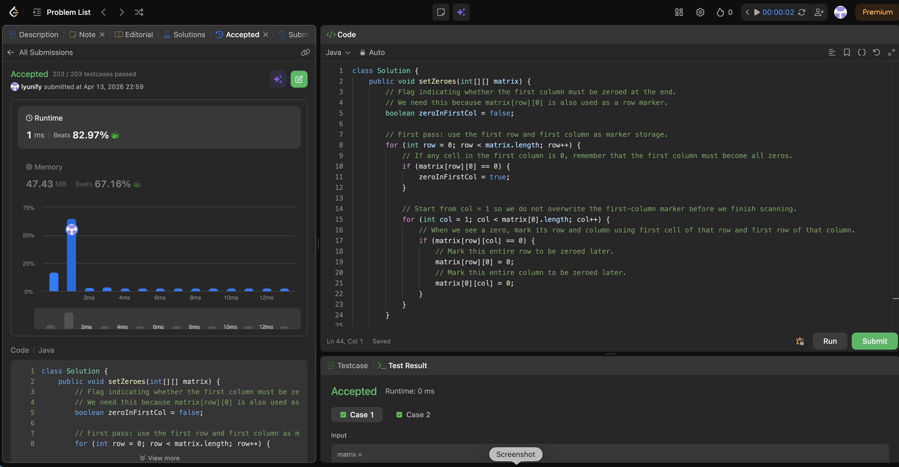

# 73. Set Matrix Zeroes

**Difficulty**: Medium<br>
**Primary Tag**: array<br>
**Secondary Tags**: matrix, hash-table<br>
**LeetCode Link**: https://leetcode.com/problems/set-matrix-zeroes/

---

## Problem Summary

Given an `m x n` integer matrix, if any element is `0`, set its entire row and column to `0` in-place. Do it with O(1) extra space.

## Screenshot



---

## My Mistake(s)

- Zeroing cells immediately during the first scan, which causes a chain reaction: newly written zeros are mistaken for original zeros and spread incorrectly.
- Forgetting that the first row and first column serve double duty as both data and markers, and overwriting them too early, losing information.
- Not using a separate boolean flag for the first column (or first row), causing incorrect results when the original first column actually contains a zero.
- Doing the second pass top-down, so markers in the first row get destroyed before they are applied to the rest of the matrix.
- Off-by-one mistakes such as starting the marker scan from `col = 0` instead of `col = 1`, corrupting the first-column marker.

## Key Insight

Reuse the first row and first column as marker arrays to achieve O(1) extra space. When `matrix[r][c] == 0`, record `matrix[r][0] = 0` and `matrix[0][c] = 0`. A separate boolean `zeroInFirstCol` is needed because `matrix[r][0]` is itself part of the marker system — without it, you can't tell whether the first column originally had a zero. The second pass must go **bottom-right to top-left** so markers are read before they are overwritten.

## Correct Approach

```java
class Solution {
    public void setZeroes(int[][] matrix) {
        boolean zeroInFirstCol = false;

        // First pass: record zeros in first row/col as markers.
        // col starts at 1 to avoid overwriting the first-column marker.
        for (int row = 0; row < matrix.length; row++) {
            if (matrix[row][0] == 0) zeroInFirstCol = true;
            for (int col = 1; col < matrix[0].length; col++) {
                if (matrix[row][col] == 0) {
                    matrix[row][0] = 0;
                    matrix[0][col] = 0;
                }
            }
        }

        // Second pass (bottom-right → top-left): apply markers.
        for (int row = matrix.length - 1; row >= 0; row--) {
            for (int col = matrix[0].length - 1; col >= 1; col--) {
                if (matrix[row][0] == 0 || matrix[0][col] == 0) {
                    matrix[row][col] = 0;
                }
            }
            if (zeroInFirstCol) matrix[row][0] = 0;
        }
    }
}
```

**Time Complexity**: O(m × n)<br>
**Space Complexity**: O(1)

---

## Practice History

| Date | Outcome | Notes |
|------|---------|-------|
| 2026-04-13 | ✅ Solved after review | Key traps: separate flag for first col, second pass must go bottom-right to avoid destroying markers |
