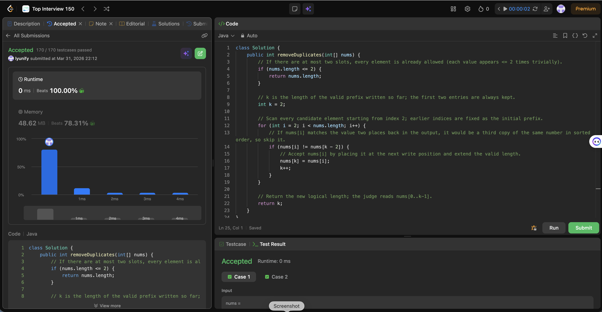

# 80. Remove Duplicates from Sorted Array II

**Difficulty**: Medium<br>
**Primary Tag**: array<br>
**Secondary Tags**: two-pointers<br>
**LeetCode Link**: https://leetcode.com/problems/remove-duplicates-from-sorted-array-ii/

---

## Problem Summary

Given a sorted integer array `nums`, remove duplicates in-place so each value appears at most twice. Return `k`, the length of the valid prefix; the judge reads `nums[0..k-1]`.

## Screenshot



---

## My Mistake(s)

- Ignored small n: starting with `k = 2` and no early return makes `n == 1` return 2, which is wrong; need `if (nums.length <= 2) return nums.length`.
- Compared with the wrong index: checking only `nums[i]` vs `nums[k-1]` does not detect a third duplicate in one pass; the trick is to compare against `nums[k - 2]` (two slots before the write head).
- Confused "two pointers" with "counting": a frequency map is O(n) extra space; the intended approach is in-place with one slow (`k`) and one fast (`i`) index.
- Off-by-one on the loop start: the pattern assumes the first two elements are always kept, so `i` must start at 2, not 0 or 1, after the small-n guard.

## Key Insight

- Sorted ⇒ duplicates are contiguous, so "allowed twice per value" can be enforced by only looking at the last two accepted positions in the compacted prefix.
- Invariant: `nums[0..k-1]` is always valid; for `i >= 2`, if `nums[i] != nums[k-2]`, then `nums[i]` is either a new value or the second copy of the current run — safe to write at `k` and increment `k`.
- Why `k - 2`: if it equals `nums[i]` while the run already occupies `k-2` and `k-1`, accepting `nums[i]` would create three equal values in a row; skip without writing.
- Time O(n), space O(1): one pass, only index variables — same family as "Remove Duplicates I" but the "at most two" rule changes the compare offset from `k-1` to `k-2`.

## Correct Approach

1. If `nums.length <= 2`, return `nums.length` — every element is trivially allowed.
2. Set `k = 2` (the first two elements are always kept as the initial valid prefix).
3. Loop `i` from 2 to `nums.length - 1`:
   - If `nums[i] != nums[k - 2]`, write `nums[k] = nums[i]` and increment `k`.
   - Otherwise skip (third-or-more copy of the same value).
4. Return `k`.

```java
class Solution {
    public int removeDuplicates(int[] nums) {
        if (nums.length <= 2) {
            return nums.length;
        }

        int k = 2;

        for (int i = 2; i < nums.length; i++) {
            if (nums[i] != nums[k - 2]) {
                nums[k] = nums[i];
                k++;
            }
        }

        return k;
    }
}
```

**Time Complexity**: O(n)<br>
**Space Complexity**: O(1)

---

## Practice History

| Date | Outcome | Notes |
|------|---------|-------|
| 2026-03-31 | ✅ | Accepted (100% runtime); mistakes on small-n guard, wrong compare index, loop start |
