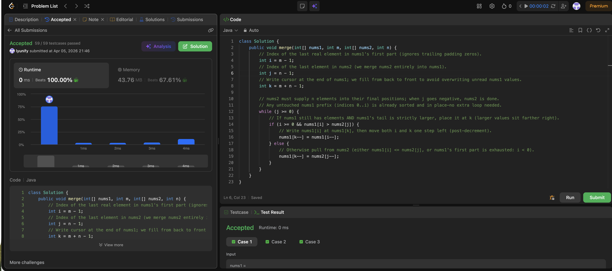

# 88. Merge Sorted Array

**Difficulty**: Easy<br>
**Primary Tag**: array<br>
**Secondary Tags**: two-pointers, sorting<br>
**LeetCode Link**: https://leetcode.com/problems/merge-sorted-array/

---

## Problem Summary

Merge two sorted integer arrays `nums1` (with `m` real values and `n` trailing padding zeros) and `nums2` (with `n` values) into `nums1` in non-decreasing order, in-place.

## Screenshot



---

## My Mistake(s)

- Misread the setup: treated `nums1.length` as the count of real values, but the problem uses `m` for that — `nums1` has physical length `m + n` with `n` trailing padding zeros.
- Wrong first instinct (merge from the front): tried two pointers from the start, which overwrites `nums1` entries still needed — classic destructive overwrite.
- Thought only copy-then-sort worked: that hides the real trick; the intended approach is using the empty tail as scratch space and merging largest-to-smallest.
- Didn't separate the three indices: `i` = last real element in `nums1`, `j` = last element in `nums2`, `k` = next write position at the right end of `nums1`.
- Confused why the loop can be `while (j >= 0)`: assumed both arrays always need draining loops. Since `nums2` has exactly `n` elements to place, when `j` hits -1 it's fully placed; any remaining `nums1` prefix is already sorted in-place and needs no movement.
- Missed the `i >= 0` guard: when `i` is -1 (first part exhausted), reading `nums1[i]` is wrong — only `nums2` remains, so the else path must handle `i < 0` by taking from `nums2`.
- Misread `>` vs `>=`: with `>`, equal values fall to the else branch and take `nums2[j]` first — still produces a valid non-decreasing merge; ties can go either way.

## Key Insight

- The empty tail of `nums1` is the whole point: merging from the back (`k = m + n - 1`, decreasing) avoids overwriting unread `nums1` data, because each write goes into a padding slot or a position already "released" by a larger value moved right.
- Fill from largest downward: at each step, place the larger of `nums1[i]` and `nums2[j]` at `nums1[k--]`, expanding the sorted suffix leftward. Still O(m + n) time, O(1) space.
- Minimal loop condition: driving the merge with `while (j >= 0)` is enough — `nums1` leftovers are already correct when `nums2` is exhausted.
- Mental model: `k` = next empty slot at the right edge of the combined range; `i`/`j` = next biggest unused item from each list, scanning backward.

## Correct Approach

Three pointers from the right: `i = m - 1`, `j = n - 1`, `k = m + n - 1`. While `nums2` has elements left, place the larger of `nums1[i]` / `nums2[j]` at `k` and decrement the chosen pointer and `k`. Guard `i >= 0` before comparing `nums1[i]`.

```java
class Solution {
    public void merge(int[] nums1, int m, int[] nums2, int n) {
        int i = m - 1;
        int j = n - 1;
        int k = m + n - 1;
        while (j >= 0) {
            if (i >= 0 && nums1[i] > nums2[j]) {
                nums1[k--] = nums1[i--];
            } else {
                nums1[k--] = nums2[j--];
            }
        }
    }
}
```

**Time Complexity**: O(m + n)<br>
**Space Complexity**: O(1)

---

## Practice History

| Date | Outcome | Notes |
|------|---------|-------|
| 2026-03-24 | ✅ Solved after review | Tried merge-from-front (destructive overwrite), missed three-pointer back-to-front trick |
| 2026-04-05 | ✅ Solved after review | Left-to-right overwrite, extra array by habit, loop condition bugs (missing nums2 drain), index confusion (m-1 vs m+n-1), redundant post-loop copy, tie-breaking anxiety |
