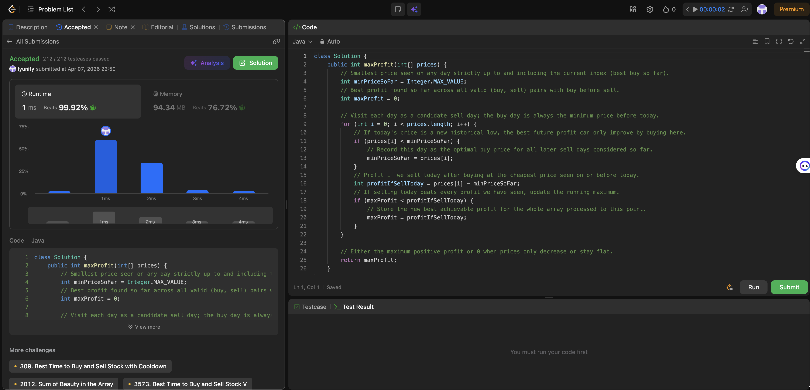

# 121. Best Time to Buy and Sell Stock

**Difficulty**: Easy<br>
**Primary Tag**: array<br>
**Secondary Tags**: dynamic-programming, greedy<br>
**LeetCode Link**: https://leetcode.com/problems/best-time-to-buy-and-sell-stock/

---

## Problem Summary

Given an array `prices` where `prices[i]` is the price of a stock on day `i`, return the maximum profit achievable by choosing a single buy day and a later sell day. Return 0 if no profit is possible.

## Screenshot



---

## My Mistake(s)

- **No clear invariant.** I knew I needed "best buy day + best sell day after it," but never stated the key rule: for a fixed sell day, the best buy is the minimum price on any earlier day.
- **Global max minus global min trap.** I thought max profit = highest price minus lowest price in the array—wrong when the lowest occurs after the highest (e.g., prices fall then rise). Buy must come before sell in time.
- **Brute force without noticing cost.** I nested loops over all (i, j) pairs with i < j. Logically correct but O(n²); I did not see that one pass while remembering the running minimum suffices.
- **Two-pointer confusion.** I tried moving "buy" and "sell" pointers like an interval problem, but the optimal buy for each sell is simply the smallest value seen so far—not a symmetric two-ended sweep.
- **Same-day edge case worry.** I fretted about subtracting the same index; the formula `prices[i] - minSoFar` naturally yields 0 for same-day transactions, which is fine.
- **Overthinking DP.** I reached for interval DP when the state is tiny: just `minPriceSoFar` and `maxProfit`.

## Key Insight

- **Anchor on the sell day.** For each index `i` as the sell day, the best profit is `prices[i] - min(prices[0..i])`. No earlier buy day can beat the prefix minimum.
- **One linear scan:** keep `minPriceSoFar` while iterating; update it when `prices[i]` is lower; compute candidate profit as `prices[i] - minPriceSoFar` and track the running max.
- **Why O(n) is correct:** every valid transaction uses some sell day; that day's optimal buy is exactly the prefix minimum. Iterating all sell days covers all valid pairs.
- **Memory hook:** "The cheapest day so far is the only buy candidate worth remembering when I consider selling today."

## Correct Approach

1. Initialize `minPriceSoFar = Integer.MAX_VALUE`, `maxProfit = 0`.
2. For each price left to right:
   - If it is a new minimum, update `minPriceSoFar`.
   - Compute `profitIfSellToday = prices[i] - minPriceSoFar`.
   - Update `maxProfit = max(maxProfit, profitIfSellToday)`.
3. Return `maxProfit`.

```java
class Solution {
    public int maxProfit(int[] prices) {
        int minPriceSoFar = Integer.MAX_VALUE;
        int maxProfit = 0;
        for (int i = 0; i < prices.length; i++) {
            if (prices[i] < minPriceSoFar) {
                minPriceSoFar = prices[i];
            }
            int profitIfSellToday = prices[i] - minPriceSoFar;
            if (maxProfit < profitIfSellToday) {
                maxProfit = profitIfSellToday;
            }
        }
        return maxProfit;
    }
}
```

**Time Complexity**: O(n)<br>
**Space Complexity**: O(1)

---

## Practice History

| Date | Outcome | Notes |
|------|---------|-------|
| 2026-03-26 | Solved after review | Fell into global-max-minus-global-min trap; key fix: anchor on sell day and track prefix minimum |
| 2026-04-07 | Solved after review | Mistakes: O(n²) brute force, updating min after profit, wrong mental model for prefix min, returning negative profit, overcomplicating with multi-state DP; key fix: one-pass invariant with minPriceSoFar and maxProfit — each day is a candidate sell day, best buy is the prefix minimum |
