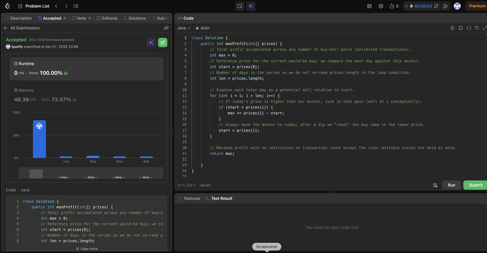

# 122. Best Time to Buy and Sell Stock II

**Difficulty**: Medium<br>
**Primary Tag**: array<br>
**Secondary Tags**: greedy, dynamic-programming<br>
**LeetCode Link**: https://leetcode.com/problems/best-time-to-buy-and-sell-stock-ii/

---

## Problem Summary

Given an array `prices` where `prices[i]` is the stock price on day `i`, find the maximum profit you can achieve. You may complete as many transactions as you like, but you may not hold more than one stock at a time.

## Screenshot



---

## My Mistake(s)

- **Applying the 121 logic directly**: Trying to track one global `minPrice` and one `maxProfit` like Stock I, which fails here because multiple transactions are allowed and you should capture profit from multiple rises.
- **Overfitting to "valley → peak" only**: Searching explicitly for local minima/maxima with many conditionals and missing edge cases; it's easy to skip a rise or double-count when prices plateau.
- **Forgetting the "one stock at a time" rule**: Adding profits from overlapping trades (conceptually buying twice before selling) instead of modeling it as consecutive buy–sell segments.
- **Not updating the anchor consistently**: If you don't move `start` to `prices[i]` every day, you can accidentally count the same increase multiple times or miss a reset after a dip.
- **Edge-case blindness**: Crashing on `prices.length == 0` (assuming at least 1 day). LeetCode typically gives n >= 1, but it's a common interview bug.

## Key Insight

- **Profit decomposition**: Any increasing run `(b−a)+(c−b) = (c−a)`. So taking every positive day-to-day gain is equivalent to buying at the start of the run and selling at the end.
- **Greedy = optimal here**: With unlimited transactions (but no simultaneous holding), the optimal strategy is to sum all positive adjacent differences: if `prices[i] > prices[i-1]`, add `prices[i] - prices[i-1]`.
- **Interpretation of `start`**: `start` is yesterday's price (the last anchor). When today is higher, you "sell today"; when today is lower, you "reset the buy" to a cheaper price automatically by updating `start`.
- **One-pass, constant space**: Single scan, O(n) time and O(1) extra space; no DP table required (though a 2-state DP is an equivalent view).
- **Mental model**: You're harvesting profit from every upward step while never holding more than one stock — exactly matching the problem constraint.

## Correct Approach

For each day starting from day 1, if today's price exceeds the anchor (`start`), collect the gain and always update the anchor to today. This greedily captures every upward segment.

```java
class Solution {
    public int maxProfit(int[] prices) {
        // Total profit accumulated across any number of buy-sell pairs (unlimited transactions).
        int max = 0;
        // Reference price for the current would-be buy; we compare the next day against this anchor.
        int start = prices[0];
        // Number of days in the series so we do not re-read prices.length in the loop condition.
        int len = prices.length;

        // Examine each later day as a potential sell relative to start.
        for (int i = 1; i < len; i++) {
            // If today's price is higher than our anchor, lock in that gain (sell at i conceptually).
            if (start < prices[i]) {
                max += prices[i] - start;
            }
            // Always move the anchor to today; after a dip we "reset" the buy idea to the lower price.
            start = prices[i];
        }

        // Maximum profit with no restriction on transaction count except the rule: multiple stocks not held at once.
        return max;
    }
}
```

**Time Complexity**: O(n)<br>
**Space Complexity**: O(1)

---

## Practice History

| Date | Outcome | Notes |
|------|---------|-------|
| 2026-04-08 | Solved after review | Applied Stock I logic; needed greedy insight that summing all positive diffs = optimal |
