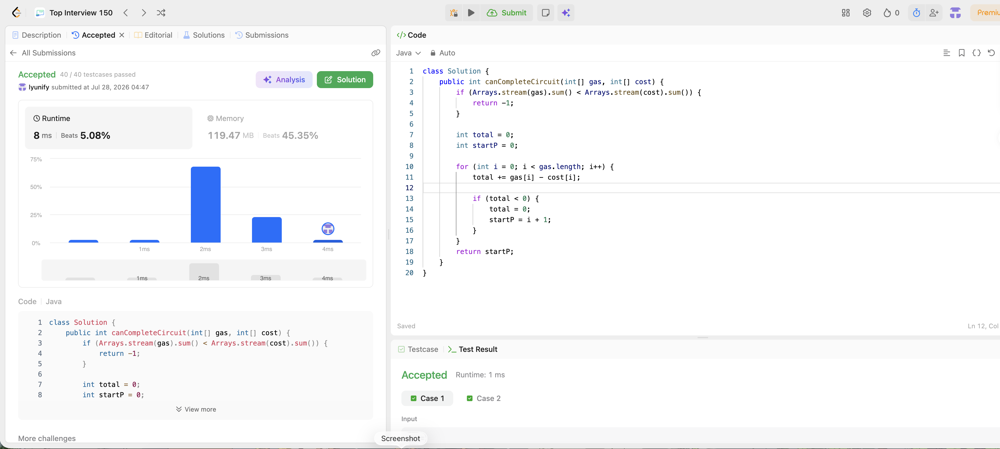

# 134. Gas Station

**Difficulty**: Medium<br>
**Primary Tag**: array<br>
**Secondary Tags**: greedy<br>
**LeetCode Link**: https://leetcode.com/problems/gas-station/

---

## Problem Summary

There are `n` gas stations in a circle. Station `i` provides `gas[i]` fuel and costs `cost[i]` to travel to the next station. Starting with an empty tank, return the index of the starting station from which you can complete the circuit, or `-1` if impossible. The answer is guaranteed to be unique if it exists.

## Screenshot



---

## My Mistake(s)

- **Brute force instinct**: Trying every starting station with a simulation loop — O(n²); times out on large inputs.
- **Missing the feasibility check**: Forgetting that if total gas < total cost, no solution exists; diving straight into the greedy without the early-exit guard.
- **Using Streams for the feasibility check**: `Arrays.stream(gas).sum()` works but is slower than a plain loop — caused a poor runtime percentile here (5.08%).
- **Resetting `startP` incorrectly**: Moving `startP` to `i` instead of `i + 1` when the running total goes negative; the station that caused the deficit cannot be a valid start.
- **Not trusting the greedy**: Doubting that the first station with a non-negative cumulative suffix is always the unique answer — it is, provably, because any earlier candidate was already eliminated.

## Key Insight

- **Feasibility**: If `sum(gas) < sum(cost)`, return `-1` immediately — no starting point can work.
- **Greedy candidate**: Walk left to right, accumulating `total += gas[i] - cost[i]`. Whenever `total < 0`, the current candidate and every station up to `i` are all invalid starts (you'd run dry passing through them). Reset `total = 0` and set `startP = i + 1`.
- **Why it works**: If total gas ≥ total cost, exactly one valid start exists. The greedy eliminates all impossibles in one pass; whatever is left must be the answer.
- **Combine both passes**: The feasibility sum and the greedy scan can share one loop — but separating them (as in the submitted code) is clearer and still O(n).

## Correct Approach

1. If `sum(gas) < sum(cost)`, return `-1`.
2. Initialize `total = 0`, `startP = 0`.
3. For each station `i`: add `gas[i] - cost[i]` to `total`. If `total < 0`, reset `total = 0` and set `startP = i + 1`.
4. Return `startP`.

```java
class Solution {
    public int canCompleteCircuit(int[] gas, int[] cost) {
        if (Arrays.stream(gas).sum() < Arrays.stream(cost).sum()) {
            return -1;
        }

        int total = 0;
        int startP = 0;

        for (int i = 0; i < gas.length; i++) {
            total += gas[i] - cost[i];

            if (total < 0) {
                total = 0;
                startP = i + 1;
            }
        }

        return startP;
    }
}
```

**Time Complexity**: O(n)<br>
**Space Complexity**: O(1)

---

## Practice History

| Date | Outcome | Notes |
|------|---------|-------|
| 2026-07-28 | ✅ Accepted | 8 ms, beats 5.08% — correct greedy but used Arrays.stream for feasibility check (slow); replace with plain loop sum for better runtime |
