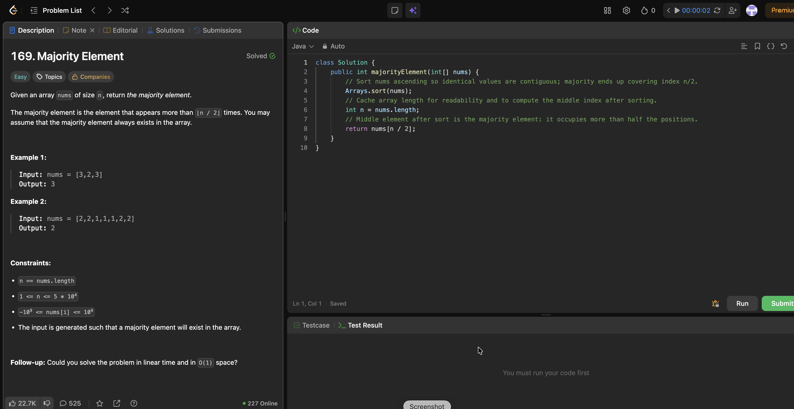

# 169. Majority Element

**Difficulty**: Easy<br>
**Primary Tag**: array<br>
**Secondary Tags**: hash-table, divide-and-conquer, sorting, counting<br>
**LeetCode Link**: https://leetcode.com/problems/majority-element/

---

## Problem Summary

Given an array of size n, return the majority element — the element that appears **more than ⌊n/2⌋ times**. The majority element is guaranteed to exist.

## Screenshot



---

## My Mistake(s)

- Confused "majority" with "mode" — this problem needs strictly more than half, not just "most frequent."
- Hesitated between `n/2` and `(n-1)/2` after sorting; needed small examples to see `nums[n/2]` is always inside the majority block when it appears more than ⌊n/2⌋ times.
- Reached for HashMap first without internalizing why the sorted median works, so the idea didn't stick for timed practice.
- Didn't connect the definition to the O(1) space follow-up (Boyer–Moore / pairing) until review.
- In-place sort mutates `nums`; fine on LeetCode but worth noting for real APIs.
- Ignoring the majority constraint: trying to count every frequency or use a HashMap when the problem only needs one value that appears > ⌊n/2⌋ times — heavier than necessary.
- Wrong index after sort: using `n/2 - 1` or `(n-1)/2` inconsistently without remembering that `n/2` always lands inside the majority block in a 0-based array.
- Forgetting the problem guarantee: doubting whether the middle element is always the answer; the statement guarantees a majority element exists, which is what makes the median-after-sort trick valid.
- Off-by-one in counting: confusing "more than half" (> n/2) with "at least half" (≥ n/2); strictly greater than n/2 is what makes the median placement reliable.

## Key Insight

- More than half ⇒ covers the middle index after sort: the majority forms one long contiguous segment, so `n/2` lies in that segment — no second scan to count runs.
- The argument is **positional** (geometry of sorted order), not just "highest frequency."
- Median intuition: with a true majority, the median of the multiset is that element; sorting makes that position `n/2` in a 0-indexed array.
- Trade-off: sort is simple (O(n log n), O(1) extra space) but mutates input; Boyer–Moore gives O(n) time and O(1) space without relying on sort.
- Pair-cancellation (voting) is the same condition in disguise: every non-majority element can be paired off with a majority element, leaving at least one majority element standing — the standard O(n) follow-up.

## Correct Approach

Sort the array. Because the majority element occupies more than half the positions, it must cover index `n/2` regardless of where its block starts.

```java
class Solution {
    public int majorityElement(int[] nums) {
        // Sort nums ascending so identical values are contiguous;
        // majority ends up covering index n/2.
        Arrays.sort(nums);
        int n = nums.length;
        // Middle element after sort is the majority element:
        // it occupies more than half the positions.
        return nums[n / 2];
    }
}
```

**Time Complexity**: O(n log n) — dominated by sort<br>
**Space Complexity**: O(1) — in-place sort (note: mutates input)

> **O(n) / O(1) follow-up — Boyer–Moore Voting:**
> Maintain a `candidate` and a `count`. For each element: if `count == 0` set `candidate = element`; if element equals `candidate` increment `count`, else decrement. The surviving candidate is the majority element.

---

## Practice History

| Date | Outcome | Notes |
|------|---------|-------|
| 2026-03-25 | ✅ Solved after review | Confused majority vs mode; sorted-median insight clicked during review; Boyer–Moore connection made after |
| 2026-04-06 | ✅ Solved after review | Reached for HashMap; wrong sort index; forgot problem guarantee; off-by-one on "more than half" definition |
