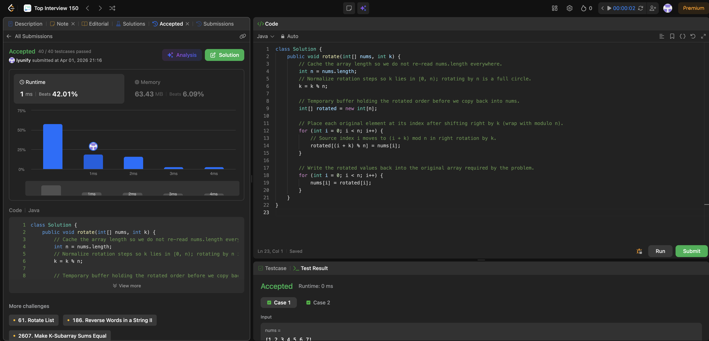

# 189. Rotate Array

**Difficulty**: Medium<br>
**Primary Tag**: array<br>
**Secondary Tags**: two-pointers, math<br>
**LeetCode Link**: https://leetcode.com/problems/rotate-array/

---

## Problem Summary

Given an integer array `nums`, rotate the array to the right by `k` steps, where `k` is non-negative. Must be done in-place.

## Screenshot



---

## My Mistake(s)

- **Forgot `k %= n`**: using raw `k` causes out-of-bounds or wrong offsets when `k >= n`; rotating by `n` is identity.
- **Wrong index formula for "right by k"**: confused where to read vs. where to write — for "move each `nums[i]` to the right by k", the destination is `(i + k) % n`, not `(i - k + n) % n` (that is the left-shift mapping).
- **Used extra space when follow-up asks O(1)**: a second array is O(n) space; the interview follow-up is the triple-reverse in-place (reverse all → reverse first k → reverse rest) after normalizing k.
- **Off-by-one with "last k elements"**: another valid formulation moves `nums[n-k..n-1]` to the front; mixing inclusive/exclusive ranges with indices is easy to get wrong.

## Key Insight

- Rotation is a permutation: index `i` goes to `(i + k) mod n` for a right rotation by `k` on `[0..n-1]`.
- **k % n**: only the remainder matters — think "effective steps" after stripping full cycles.
- **Auxiliary array recipe**: `rotated[(i + k) % n] = nums[i]` for all `i`, then copy back — O(n) time, O(n) space.
- **In-place upgrade (triple reverse)**: `reverse(0, n-1)` → `reverse(0, k-1)` → `reverse(k, n-1)` achieves the same result in O(1) space when `k` is normalized to `[0, n)`.

## Correct Approach

1. Normalize: `k = k % n` (handle k ≥ n).
2. **O(n) space**: allocate `rotated[n]`, set `rotated[(i+k)%n] = nums[i]` for each `i`, copy back.
3. **O(1) space (triple reverse)**:
   - Reverse the entire array.
   - Reverse the first `k` elements.
   - Reverse elements from index `k` to `n-1`.

```java
// O(n) space solution (submitted)
class Solution {
    public void rotate(int[] nums, int k) {
        int n = nums.length;
        k = k % n;

        int[] rotated = new int[n];
        for (int i = 0; i < n; i++) {
            rotated[(i + k) % n] = nums[i];
        }
        for (int i = 0; i < n; i++) {
            nums[i] = rotated[i];
        }
    }
}

// O(1) space solution (triple reverse)
class Solution {
    public void rotate(int[] nums, int k) {
        int n = nums.length;
        k = k % n;
        reverse(nums, 0, n - 1);
        reverse(nums, 0, k - 1);
        reverse(nums, k, n - 1);
    }
    private void reverse(int[] nums, int l, int r) {
        while (l < r) {
            int tmp = nums[l];
            nums[l++] = nums[r];
            nums[r--] = tmp;
        }
    }
}
```

**Time Complexity**: O(n)<br>
**Space Complexity**: O(n) for auxiliary array; O(1) for triple-reverse

---

## Practice History

| Date | Outcome | Notes |
|------|---------|-------|
| 2026-04-01 | ✅ Solved after review | Forgot k%=n; confused read/write index direction; used O(n) space instead of triple-reverse |
