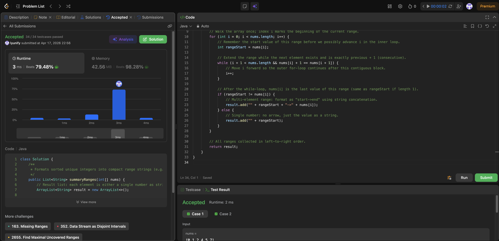

# 228. Summary Ranges

**Difficulty**: Easy<br>
**Primary Tag**: array<br>
**Secondary Tags**: two-pointers<br>
**LeetCode Link**: https://leetcode.com/problems/summary-ranges/

---

## Problem Summary

Given a sorted unique integer array, return the smallest sorted list of ranges that cover all the numbers exactly. A range `[a, b]` is represented as `"a->b"` if `a != b`, or `"a"` if `a == b`.

## Screenshot



---

## My Mistake(s)

- Forgetting that the inner loop modifies `i`, so the range end must be read **after** the loop, not assumed from the initial `i`.
- Mixing up `nums[i] + 1 == nums[i+1]` with strict inequality or off-by-one on the `i+1` bounds check.
- Forgetting empty input (`nums.length == 0`)—the outer loop simply does not run and returns an empty list, which is correct.

## Key Insight

The array is already sorted, so each "range" is a maximal contiguous block of values differing by 1. One pointer marks the start of the block (`rangeStart = nums[i]`); an inner `while` loop advances `i` while `nums[i] + 1 == nums[i+1]`, merging the whole run in one pass. After the inner loop, `nums[i]` is the end of that run—compare it to `rangeStart` to choose `"a"` vs `"a->b"`. Reusing the same index `i` in both loops avoids an extra end variable, but you **must** save `rangeStart` before the inner loop mutates `i`.

## Correct Approach

1. Handle the trivial empty-input case implicitly—the loop doesn't run.
2. Outer `for` loop: `i` walks through every index.
3. Save `rangeStart = nums[i]`.
4. Inner `while` loop: advance `i` while `i + 1 < nums.length && nums[i] + 1 == nums[i+1]`.
5. After the inner loop, `nums[i]` is the range end.
6. If `rangeStart != nums[i]`, add `"rangeStart->nums[i]"`; else add `"rangeStart"`.
7. Outer `for` loop's `i++` moves past the last element of the finished range.

```java
public List<String> summaryRanges(int[] nums) {
    List<String> result = new ArrayList<>();
    for (int i = 0; i < nums.length; i++) {
        int rangeStart = nums[i];
        while (i + 1 < nums.length && nums[i] + 1 == nums[i + 1]) {
            i++;
        }
        if (rangeStart != nums[i]) {
            result.add("" + rangeStart + "->" + nums[i]);
        } else {
            result.add("" + rangeStart);
        }
    }
    return result;
}
```

**Time Complexity**: O(n)<br>
**Space Complexity**: O(1) (excluding output list)

---

## Practice History

| Date | Outcome | Notes |
|------|---------|-------|
| 2026-04-17 | ✅ | Solved after review. Needed reminder to save rangeStart before inner loop advances i; also tripped on bounds check ordering. |
