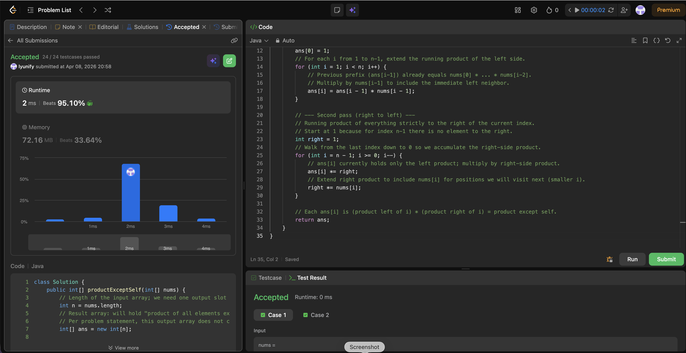

# 238. Product of Array Except Self

**Difficulty**: Medium<br>
**Primary Tag**: array<br>
**Secondary Tags**: prefix-sum<br>
**LeetCode Link**: https://leetcode.com/problems/product-of-array-except-self/

---

## Problem Summary

Given an integer array `nums`, return an array `answer` such that `answer[i]` is equal to the product of all elements of `nums` except `nums[i]`, without using division and in O(n) time.

## Screenshot



---

## My Mistake(s)

- First instinct is often a nested loop: for each i, multiply all j != i. That is O(n²) and times out for large n (e.g. 10^5) on LeetCode.
- Easy to forget that `ans[0]` and the last index need the "missing side" to behave like multiply by 1.
- If you build separate `left[]` and `right[]` arrays without thinking, you use O(n) extra space; the optimized pattern avoids an explicit right array by using one integer and updating in one pass.

## Key Insight

The answer at index i splits cleanly: `(product of nums[0..i-1]) * (product of nums[i+1..n-1])`. You do not need division. Reuse the output array: first store the left prefix products, then sweep from the right with a single "right running product" variable to fold in the suffix in O(1) extra space besides the output. Empty products (no elements on one side) are 1, which is why `ans[0]` starts as 1 and `right` starts as 1.

## Correct Approach

1. Initialize `ans[0] = 1`. For each `i` from 1 to n-1, set `ans[i] = ans[i-1] * nums[i-1]` (left prefix product).
2. Initialize `right = 1`. Walk from `i = n-1` down to 0: multiply `ans[i] *= right`, then `right *= nums[i]`.
3. Return `ans`.

```java
class Solution {
    public int[] productExceptSelf(int[] nums) {
        int n = nums.length;
        int[] ans = new int[n];

        // First pass (left to right): ans[i] = product of all elements left of i
        ans[0] = 1;
        for (int i = 1; i < n; i++) {
            ans[i] = ans[i - 1] * nums[i - 1];
        }

        // Second pass (right to left): fold in product of all elements right of i
        int right = 1;
        for (int i = n - 1; i >= 0; i--) {
            ans[i] *= right;
            right *= nums[i];
        }

        return ans;
    }
}
```

**Time Complexity**: O(n)<br>
**Space Complexity**: O(1) extra (output array not counted)

---

## Practice History

| Date | Outcome | Notes |
|------|---------|-------|
| 2026-04-08 | ✅ | Solved after review — remembered prefix product split; missed the O(1) space optimization initially |
