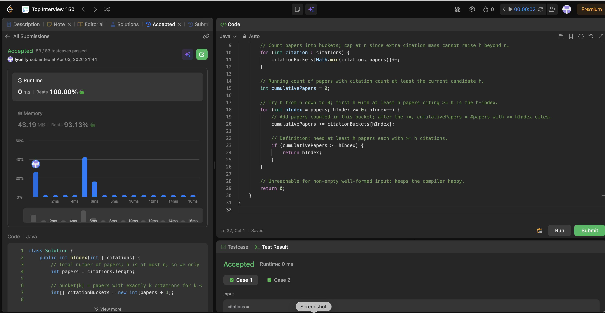

# 274. H-Index

**Difficulty**: Medium<br>
**Primary Tag**: array<br>
**Secondary Tags**: sorting, counting<br>
**LeetCode Link**: https://leetcode.com/problems/h-index/

---

## Problem Summary

Given an array of citation counts, return the researcher's h-index: the largest h such that at least h papers each have at least h citations.

## Screenshot



---

## My Mistake(s)

- **Mixing "papers" and "citations"**: The definition requires "at least h papers" AND "each has at least h citations" — both sides must line up on the same h.
- **Off-by-one on buckets**: Need length n + 1 and `min(citation, n)` so nothing goes out of bounds and the suffix sum "how many papers have ≥ h cites" stays correct.
- **Thinking only sort helps**: Sort descending then scan is valid but O(n log n); easy to miss the O(n) bucket counting approach.
- **Wrong scan direction**: You want the largest h that works; walking h from n down to 0 and returning the first cumulative ≥ h gives exactly that.

## Key Insight

h cannot exceed n (the number of papers), so any citation count ≥ n can be folded into bucket[n]. Build a frequency array of size n + 1 where `bucket[k]` = papers with exactly k citations (capped at n), then scan h from n down to 0 accumulating a suffix sum; the first h where cumulative ≥ h is the answer.

## Correct Approach

1. Let `papers = citations.length`. Allocate `citationBuckets[papers + 1]`.
2. For each citation, increment `citationBuckets[min(citation, papers)]`.
3. Walk `hIndex` from `papers` down to `0`, adding `citationBuckets[hIndex]` to `cumulativePapers`.
4. The moment `cumulativePapers >= hIndex`, return `hIndex`.

```java
class Solution {
    public int hIndex(int[] citations) {
        int papers = citations.length;
        int[] citationBuckets = new int[papers + 1];

        for (int citation : citations) {
            citationBuckets[Math.min(citation, papers)]++;
        }

        int cumulativePapers = 0;
        for (int hIndex = papers; hIndex >= 0; hIndex--) {
            cumulativePapers += citationBuckets[hIndex];
            if (cumulativePapers >= hIndex) {
                return hIndex;
            }
        }

        return 0;
    }
}
```

**Time Complexity**: O(n)<br>
**Space Complexity**: O(n)

---

## Practice History

| Date | Outcome | Notes |
|------|---------|-------|
| 2026-04-03 | ✅ | Accepted, 0 ms (beats 100%), 43.19 MB (beats 93.13%). Bucket counting approach. |
