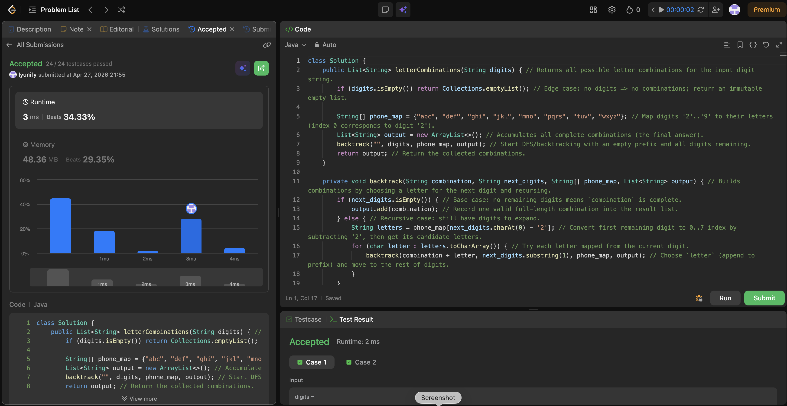

# 17. Letter Combinations of a Phone Number

**Difficulty**: Medium<br>
**Primary Tag**: backtracking<br>
**Secondary Tags**: hash-table, string<br>
**LeetCode Link**: https://leetcode.com/problems/letter-combinations-of-a-phone-number/

---

## Problem Summary

Given a string of digits 2–9, return all possible letter combinations that the digits could represent on a phone keypad.

## Screenshot



---

## My Mistake(s)

- Forgetting Java imports (`List`, `ArrayList`, `Collections`) can cause compile errors even when the algorithm is correct.
- Off-by-one / wrong-index mapping is easy here (e.g., mapping `'2'` to index 2 instead of 0); always sanity-check `'2'` → `"abc"` and `'9'` → `"wxyz"`.
- Returning `null` or a list containing `""` for empty input is incorrect; the expected output for `digits=""` is an empty list `[]`.

## Key Insight

- Backtracking is essentially building a prefix step by step; each recursive call fixes one digit and branches over all its letters.
- A clean mapping trick is `digitChar - '2'` to convert digits `'2'..'9'` into indices `0..7`.
- The base case should be "no remaining digits", at which point the current combination is a complete answer and can be added to the result.

## Correct Approach

Use a `phone_map` array indexed by `digit - '2'`. Start backtracking with an empty prefix and the full digit string. At each level, peel off the first digit, iterate over its mapped letters, append each to the prefix, and recurse on the remaining digits. When no digits remain, record the combination.

```java
class Solution {
    public List<String> letterCombinations(String digits) {
        if (digits.isEmpty()) return Collections.emptyList();

        String[] phone_map = {"abc", "def", "ghi", "jkl", "mno", "pqrs", "tuv", "wxyz"};
        List<String> output = new ArrayList<>();
        backtrack("", digits, phone_map, output);
        return output;
    }

    private void backtrack(String combination, String next_digits, String[] phone_map, List<String> output) {
        if (next_digits.isEmpty()) {
            output.add(combination);
        } else {
            String letters = phone_map[next_digits.charAt(0) - '2'];
            for (char letter : letters.toCharArray()) {
                backtrack(combination + letter, next_digits.substring(1), phone_map, output);
            }
        }
    }
}
```

**Time Complexity**: O(4^n · n) where n is the number of digits (4 is the max letters per digit)<br>
**Space Complexity**: O(n) recursion depth

---

## Practice History

| Date | Outcome | Notes |
|------|---------|-------|
| 2026-04-27 | ✅ | Solved after review; mistakes: missing imports, index mapping off-by-one, wrong empty-input return value |
