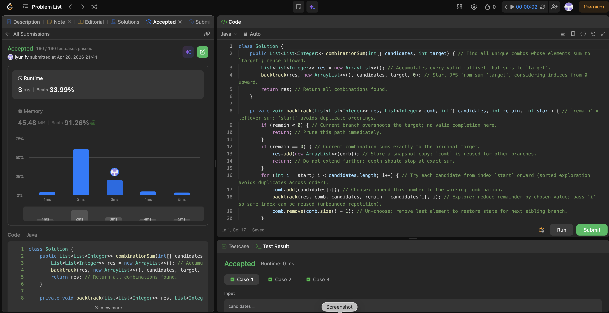

# 0039. Combination Sum

**Difficulty**: Medium<br>
**Primary Tag**: backtracking<br>
**Secondary Tags**: array<br>
**LeetCode Link**: https://leetcode.com/problems/combination-sum/

---

## Problem Summary

Given an array of distinct integers `candidates` and a target integer `target`, return all unique combinations of candidates where the chosen numbers sum to `target`. The same number may be chosen from candidates an unlimited number of times.

## Screenshot



---

## My Mistake(s)

- Confused this with subset sum or "each number once" — using `i + 1` instead of `i` as the next start index breaks unbounded reuse.
- Added the result list without `new ArrayList<>(comb)`, so every stored combo aliases the same mutable list and all entries look identical at the end.
- Allowed the loop to explore previous indices again, which duplicates combinations like `[2,3]` and `[3,2]` when elements can repeat.

## Key Insight

Use a `start` index so each combination is built in non-decreasing position order, preventing the same multiset from being counted as different orderings. After picking `candidates[i]`, recurse with `i` unchanged (not `i + 1`) so the same element can be reused — that's what "unlimited reuse" means without any extra bookkeeping. Using `remain` as the recursion parameter keeps base cases simple: `remain == 0` records an answer, `remain < 0` prunes.

## Correct Approach

1. Initialize a result list and call `backtrack(res, [], candidates, target, 0)`.
2. In backtrack: if `remain < 0`, prune (return); if `remain == 0`, add a copy of `comb` to results.
3. Loop `i` from `start` to end of candidates:
   - Choose: add `candidates[i]` to `comb`.
   - Explore: recurse with `remain - candidates[i]` and same `i` (allows reuse).
   - Un-choose: remove last element from `comb`.

```java
class Solution {
    public List<List<Integer>> combinationSum(int[] candidates, int target) {
        List<List<Integer>> res = new ArrayList<>();
        backtrack(res, new ArrayList<>(), candidates, target, 0);
        return res;
    }

    private void backtrack(List<List<Integer>> res, List<Integer> comb,
                           int[] candidates, int remain, int start) {
        if (remain < 0) return;
        if (remain == 0) {
            res.add(new ArrayList<>(comb)); // snapshot copy — not a reference
            return;
        }
        for (int i = start; i < candidates.length; i++) {
            comb.add(candidates[i]);
            backtrack(res, comb, candidates, remain - candidates[i], i); // i, not i+1
            comb.remove(comb.size() - 1);
        }
    }
}
```

**Time Complexity**: O(N^(T/M)) where N = candidates length, T = target, M = min candidate<br>
**Space Complexity**: O(T/M) recursion depth

---

## Practice History

| Date | Outcome | Notes |
|------|---------|-------|
| 2026-04-28 | Solved after review | Mixed up i vs i+1 for reuse; forgot ArrayList copy |
