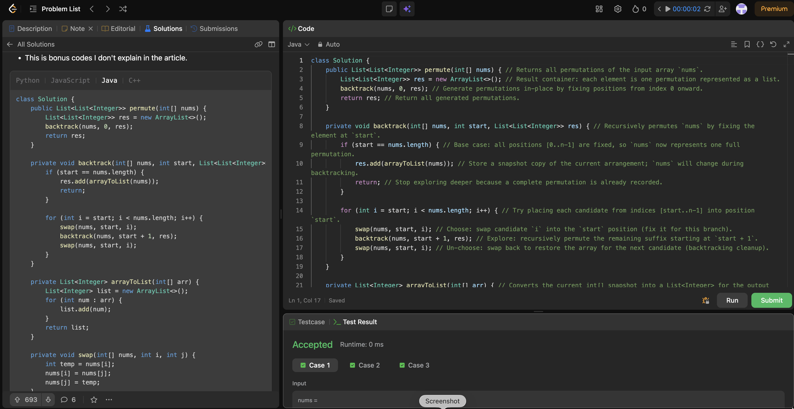

# 46. Permutations

**Difficulty**: Medium<br>
**Primary Tag**: backtracking<br>
**Secondary Tags**: array<br>
**LeetCode Link**: https://leetcode.com/problems/permutations/

---

## Problem Summary

Given an array of distinct integers, return all possible permutations in any order.

## Screenshot



---

## My Mistake(s)

- Forgetting the swap-back step leaves the array in a modified state and corrupts all later permutations.
- Adding the current permutation to `res` without copying (storing a reference to the same `nums`) makes all results end up identical after further swaps.
- Using the wrong base case (e.g., `start == nums.length - 1` without handling it correctly) can miss permutations or produce incomplete ones.

## Key Insight

- In-place permutation with swapping works by fixing one position at a time: at recursion depth `start`, we decide which element goes to index `start`.
- The pattern is **swap (choose) → recurse (explore) → swap back (un-choose)**; the swap-back is what restores the array for the next branch.
- When saving an answer, store a snapshot copy (`arrayToList(nums)`) because the same `nums` array is reused and mutated throughout recursion.

## Correct Approach

At each level, iterate `i` from `start` to `nums.length - 1`: swap `nums[start]` and `nums[i]` to place candidate `i` at position `start`, recurse on `start + 1`, then swap back. When `start == nums.length`, all positions are fixed — record a copy of the current array.

```java
class Solution {
    public List<List<Integer>> permute(int[] nums) {
        List<List<Integer>> res = new ArrayList<>();
        backtrack(nums, 0, res);
        return res;
    }

    private void backtrack(int[] nums, int start, List<List<Integer>> res) {
        if (start == nums.length) {
            res.add(arrayToList(nums)); // snapshot copy
            return;
        }
        for (int i = start; i < nums.length; i++) {
            swap(nums, start, i);           // choose
            backtrack(nums, start + 1, res); // explore
            swap(nums, start, i);           // un-choose
        }
    }

    private List<Integer> arrayToList(int[] arr) {
        List<Integer> list = new ArrayList<>();
        for (int num : arr) list.add(num);
        return list;
    }

    private void swap(int[] nums, int i, int j) {
        int temp = nums[i];
        nums[i] = nums[j];
        nums[j] = temp;
    }
}
```

**Time Complexity**: O(n! · n) — n! permutations each taking O(n) to copy<br>
**Space Complexity**: O(n) recursion depth

---

## Practice History

| Date | Outcome | Notes |
|------|---------|-------|
| 2026-04-28 | ✅ | Solved after review; mistakes: missing swap-back, no snapshot copy, wrong base case |
