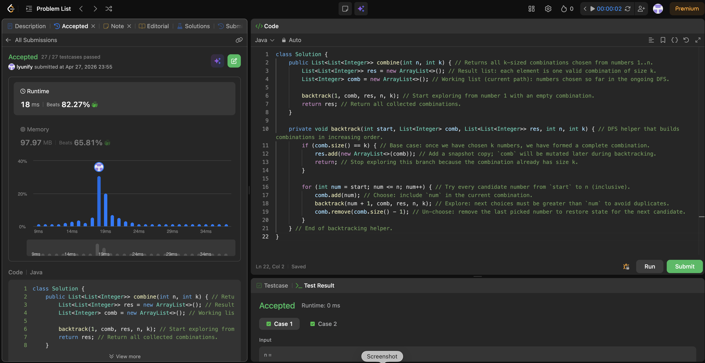

# 77. Combinations

**Difficulty**: Medium<br>
**Primary Tag**: backtracking<br>
**Secondary Tags**: <br>
**LeetCode Link**: https://leetcode.com/problems/combinations/

---

## Problem Summary

Given two integers `n` and `k`, return all possible combinations of `k` numbers chosen from the range `[1, n]`.

## Screenshot



---

## My Mistake(s)

- Forgetting to copy the current combination (`res.add(new ArrayList<>(comb))` instead of `res.add(comb)`) causes all results to reference the same mutated list, so every entry ends up identical after backtracking completes.
- Using the wrong next start — recursing with `start + 1` instead of `num + 1` — can skip valid combinations or produce duplicates.
- Missing Java imports (`List`, `ArrayList`) causes compile errors even when the algorithm logic is correct.

## Key Insight

- Backtracking for combinations works by maintaining an increasing `start` pointer, which guarantees no duplicates and keeps each combination in sorted order.
- The key implementation detail is to copy the current path when it reaches size `k` (`new ArrayList<>(comb)`), because the same `comb` list will be mutated during further recursion.
- Thinking in three steps — **choose**, **explore**, **un-choose** — prevents state bugs and makes the recursion structure easy to reason about.

## Correct Approach

Initialize an empty `comb` list and recurse from `start = 1`. At each level, iterate `num` from `start` to `n`: add `num` to `comb` (choose), recurse with `num + 1` (explore), then remove the last element (un-choose). When `comb.size() == k`, record a snapshot copy into the result.

```java
class Solution {
    public List<List<Integer>> combine(int n, int k) {
        List<List<Integer>> res = new ArrayList<>();
        List<Integer> comb = new ArrayList<>();
        backtrack(1, comb, res, n, k);
        return res;
    }

    private void backtrack(int start, List<Integer> comb, List<List<Integer>> res, int n, int k) {
        if (comb.size() == k) {
            res.add(new ArrayList<>(comb)); // snapshot — comb will be mutated later
            return;
        }
        for (int num = start; num <= n; num++) {
            comb.add(num);                        // choose
            backtrack(num + 1, comb, res, n, k); // explore
            comb.remove(comb.size() - 1);         // un-choose
        }
    }
}
```

**Time Complexity**: O(C(n,k) · k) — C(n,k) combinations each taking O(k) to copy<br>
**Space Complexity**: O(k) recursion depth

---

## Practice History

| Date | Outcome | Notes |
|------|---------|-------|
| 2026-04-27 | ✅ | Solved after review; mistakes: no snapshot copy, wrong next-start index, missing imports |
