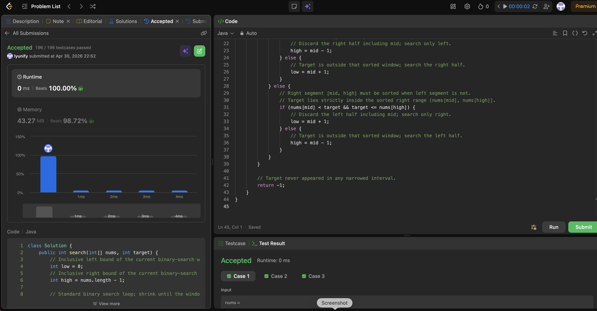

# 33. Search in Rotated Sorted Array

**Difficulty**: Medium<br>
**Primary Tag**: binary-search<br>
**Secondary Tags**: array<br>
**LeetCode Link**: https://leetcode.com/problems/search-in-rotated-sorted-array/

---

## Problem Summary

Given an integer array `nums` sorted in ascending order and possibly rotated at an unknown pivot, and an integer `target`, return the index of `target` or `-1` if not present. Must run in O(log n).

## Screenshot



---

## My Mistake(s)

- Mixed up which side is sorted when `nums[low] <= nums[mid]` fails — sometimes assumed "always search right" without checking the sorted half's bounds.
- Used inclusive bounds incorrectly at `mid` (e.g., `target <= nums[mid]` on the left branch after equality was already handled), which can skip or duplicate logic.
- Forgot that when the array has duplicates this template needs care — problem 33 has distinct elements, but confusing it with the "II" variant leads to wrong pruning.
- Used `(low + high) / 2` without thinking about overflow on very large indices; prefer `low + (high - low) / 2`.
- Occasionally hesitated between `low <= high` and `low < high`; this solution needs inclusive bounds with `mid - 1` / `mid + 1` updates consistently.

## Key Insight

After rotation, **exactly one of the two halves split by `mid` is still sorted**. Compare `nums[low]` with `nums[mid]`:
- If `nums[low] <= nums[mid]`, the left half `[low, mid]` is sorted. Check whether `target ∈ [nums[low], nums[mid])` — if yes, search left (`high = mid - 1`); otherwise search right (`low = mid + 1`).
- Otherwise the right half `[mid, high]` is sorted. Check whether `target ∈ (nums[mid], nums[high]]` — if yes, search right (`low = mid + 1`); otherwise search left (`high = mid - 1`).

Each step removes half the indices while preserving the invariant that if `target` exists it stays inside `[low, high]`. Use strict inequalities on the side where `mid` was already ruled out because `nums[mid] != target` at that point.

## Correct Approach

1. Initialize `low = 0`, `high = n - 1`.
2. While `low <= high`:
   - `mid = low + (high - low) / 2`.
   - If `nums[mid] == target`, return `mid`.
   - If `nums[low] <= nums[mid]` (left half is sorted):
     - If `nums[low] <= target < nums[mid]`: `high = mid - 1`.
     - Else: `low = mid + 1`.
   - Else (right half `[mid, high]` is sorted):
     - If `nums[mid] < target <= nums[high]`: `low = mid + 1`.
     - Else: `high = mid - 1`.
3. Return `-1`.

```java
class Solution {
    public int search(int[] nums, int target) {
        int low = 0;
        int high = nums.length - 1;
        while (low <= high) {
            int mid = low + (high - low) / 2;
            if (nums[mid] == target) return mid;
            if (nums[low] <= nums[mid]) {
                // Left segment [low, mid] is sorted.
                if (nums[low] <= target && target < nums[mid]) {
                    high = mid - 1;
                } else {
                    low = mid + 1;
                }
            } else {
                // Right segment [mid, high] is sorted.
                if (nums[mid] < target && target <= nums[high]) {
                    low = mid + 1;
                } else {
                    high = mid - 1;
                }
            }
        }
        return -1;
    }
}
```

**Time Complexity**: O(log n)<br>
**Space Complexity**: O(1)

---

## Practice History

| Date | Outcome | Notes |
|------|---------|-------|
| 2026-04-30 | ✅ Solved after review | Key: one half is always sorted; test target against that half's bounds to decide which side to discard |
