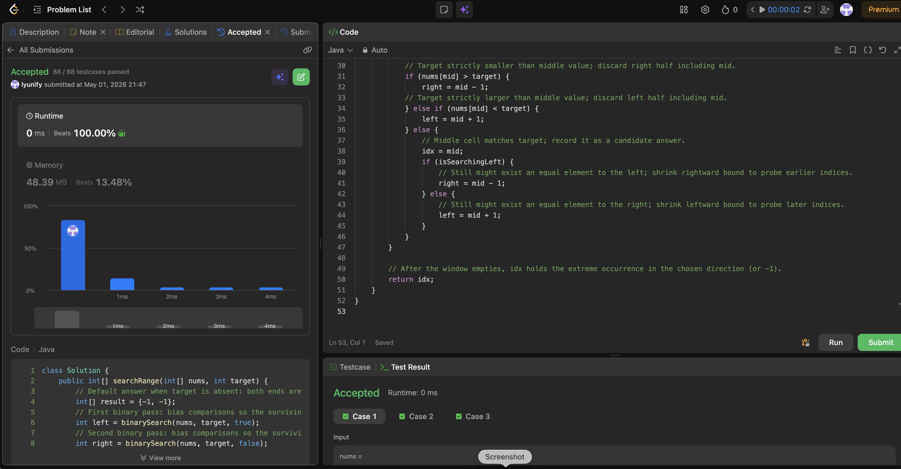

# 34. Find First and Last Position of Element in Sorted Array

**Difficulty**: Medium<br>
**Primary Tag**: binary-search<br>
**Secondary Tags**: array<br>
**LeetCode Link**: https://leetcode.com/problems/find-first-and-last-position-of-element-in-sorted-array/

---

## Problem Summary

Given an array of integers sorted in non-decreasing order (with possible duplicates) and a target, return the starting and ending positions of the target. Return `[-1, -1]` if not found.

## Screenshot



---

## My Mistake(s)

- Wrote one binary search that returns any index and then linearly scanned outward — correct but not optimal and easy to mess up edge cases.
- Confused `lower_bound` / `upper_bound` style (first `>=` vs first `>`) with this problem's inclusive range, leading to off-by-one when converting to `[first, last]`.
- Sometimes returned `mid` immediately on equality without narrowing, which misses duplicates on one side.
- Mixed up which side to shrink when `nums[mid] == target`: left-bound search needs shrinking `right`, not `left`.
- Occasionally used `while (left < right)` with a template meant for `<=`, causing infinite loops or wrong termination.

## Key Insight

One sorted array with duplicates does not let you stop at the first `nums[mid] == target`; you need two tailored binary searches. When `nums[mid] == target`, still move the boundary that keeps the search alive in the direction you care about:

- **First index**: set `right = mid - 1` and keep updating `idx` whenever you see a match, so the last successful `mid` in that left-biased walk is the leftmost target.
- **Last index**: mirror with `left = mid + 1` so `idx` ends at the rightmost target.

Standard `<` and `>` branches stay identical to normal binary search. Overall time is two O(log n) passes, space is O(1).

## Correct Approach

Run two binary searches over the same array, differing only in how the equality branch narrows the window:

1. **Find leftmost**: on match, record `idx = mid` then set `right = mid - 1` to keep probing left.
2. **Find rightmost**: on match, record `idx = mid` then set `left = mid + 1` to keep probing right.
3. Both searches use `while (left <= right)` and identical `>` / `<` branches.
4. Return `[leftmost, rightmost]`; if target is absent both stay `-1`.

```java
class Solution {
    public int[] searchRange(int[] nums, int target) {
        int[] result = {-1, -1};
        int left = binarySearch(nums, target, true);
        int right = binarySearch(nums, target, false);
        result[0] = left;
        result[1] = right;
        return result;
    }

    private int binarySearch(int[] nums, int target, boolean isSearchingLeft) {
        int left = 0, right = nums.length - 1, idx = -1;
        while (left <= right) {
            int mid = left + (right - left) / 2;
            if (nums[mid] > target) {
                right = mid - 1;
            } else if (nums[mid] < target) {
                left = mid + 1;
            } else {
                idx = mid;
                if (isSearchingLeft) {
                    right = mid - 1; // keep probing left
                } else {
                    left = mid + 1;  // keep probing right
                }
            }
        }
        return idx;
    }
}
```

**Time Complexity**: O(log n)<br>
**Space Complexity**: O(1)

---

## Practice History

| Date | Outcome | Notes |
|------|---------|-------|
| 2026-05-01 | ✅ Solved after review | Two separate binary searches with biased equality branch; confused which boundary to shrink on match |
