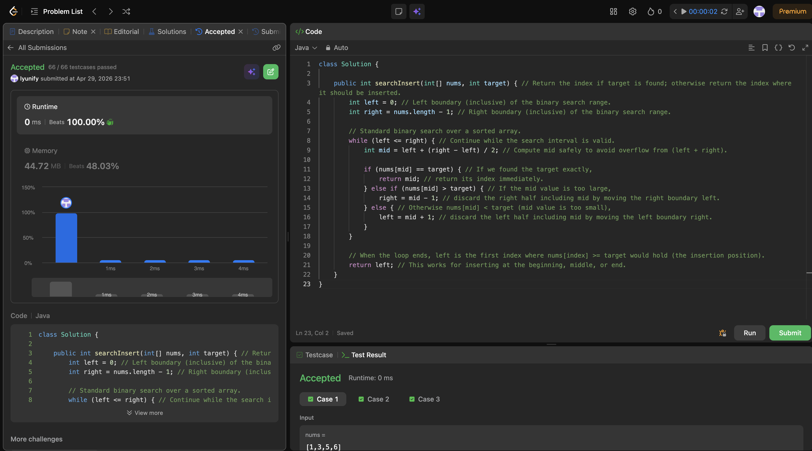

# 35. Search Insert Position

**Difficulty**: Easy<br>
**Primary Tag**: binary-search<br>
**Secondary Tags**: array<br>
**LeetCode Link**: https://leetcode.com/problems/search-insert-position/

---

## Problem Summary

Given a sorted array of distinct integers and a target, return the index if the target is found. Otherwise, return the index where it would be inserted to keep the array sorted.

## Screenshot



---

## My Mistake(s)

- Overthought the "not found" case by trying to return `right + 1` or adding extra branches; the clean invariant is that the final `left` is always the correct insertion position.
- Mixed up boundary conditions (`<` vs `<=`) which leads to infinite loops or off-by-one errors; sticking to a consistent `while (left <= right)` template prevents that.

## Key Insight

After a binary search with `while (left <= right)`, when the loop terminates, `left` always points to the correct insertion index — the first position where target can be placed without breaking sorted order. Returning `left` naturally handles all edge cases: insert before the first element, between elements, or after the last element.

## Correct Approach

1. Set `left = 0`, `right = nums.length - 1`.
2. Binary search: if `nums[mid] == target`, return `mid` immediately.
3. If `nums[mid] > target`, move `right = mid - 1`; otherwise `left = mid + 1`.
4. When the loop ends, return `left` as the insertion position.

```java
class Solution {
    public int searchInsert(int[] nums, int target) {
        int left = 0;
        int right = nums.length - 1;

        while (left <= right) {
            int mid = left + (right - left) / 2;

            if (nums[mid] == target) {
                return mid;
            } else if (nums[mid] > target) {
                right = mid - 1;
            } else {
                left = mid + 1;
            }
        }

        return left;
    }
}
```

**Time Complexity**: O(log n)<br>
**Space Complexity**: O(1)

---

## Practice History

| Date | Outcome | Notes |
|------|---------|-------|
| 2026-04-30 | ✅ Solved after review | Added unnecessary branches for "not found"; confused `<` vs `<=` boundary |
