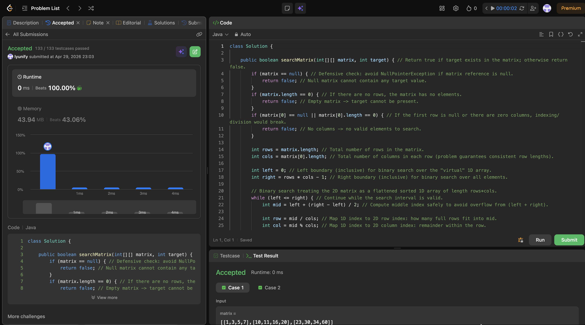

# 74. Search a 2D Matrix

**Difficulty**: Medium<br>
**Primary Tag**: binary-search<br>
**Secondary Tags**: array, matrix<br>
**LeetCode Link**: https://leetcode.com/problems/search-a-2d-matrix/

---

## Problem Summary

Given an `m x n` integer matrix where each row is sorted and the first element of each row is greater than the last element of the previous row, return `true` if a given target exists in the matrix.

## Screenshot



---

## My Mistake(s)

- Did not guard against `matrix.length == 0` or `matrix[0].length == 0`, which can cause out-of-bounds or divide-by-zero errors in Java.
- Initially used `(left + right) / 2`; switching to `left + (right - left) / 2` is safer to avoid potential integer overflow.

## Key Insight

The matrix can be treated as a single sorted 1D array because each row is sorted and the first element of a row is greater than the last element of the previous row. Using a virtual index `mid` and mapping it back with `row = mid / cols` and `col = mid % cols` lets you run one clean binary search in O(log(rows × cols)).

## Correct Approach

1. Guard against null/empty matrix and empty first row.
2. Set `left = 0`, `right = rows * cols - 1`.
3. Binary search: compute `mid = left + (right - left) / 2`, map to 2D via `row = mid / cols`, `col = mid % cols`.
4. Compare `matrix[row][col]` with target; adjust `left`/`right` or return `true`.
5. Return `false` if search space exhausted.

```java
class Solution {
    public boolean searchMatrix(int[][] matrix, int target) {
        if (matrix == null) return false;
        if (matrix.length == 0) return false;
        if (matrix[0] == null || matrix[0].length == 0) return false;

        int rows = matrix.length;
        int cols = matrix[0].length;
        int left = 0, right = rows * cols - 1;

        while (left <= right) {
            int mid = left + (right - left) / 2;
            int row = mid / cols;
            int col = mid % cols;

            if (matrix[row][col] == target) return true;
            else if (matrix[row][col] < target) left = mid + 1;
            else right = mid - 1;
        }
        return false;
    }
}
```

**Time Complexity**: O(log(rows × cols))<br>
**Space Complexity**: O(1)

---

## Practice History

| Date | Outcome | Notes |
|------|---------|-------|
| 2026-04-29 | ✅ Solved after review | Missed input guards; used unsafe mid calculation initially |
