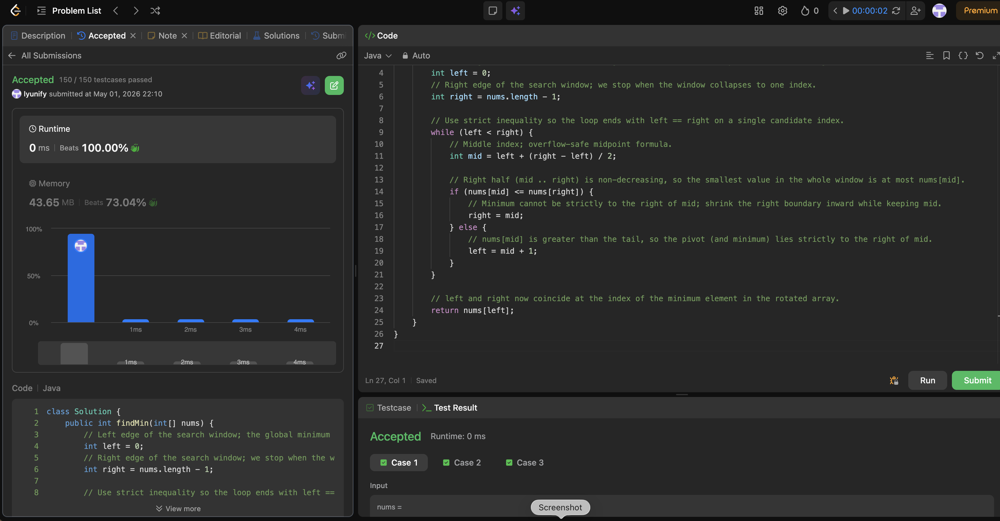

# 153. Find Minimum in Rotated Sorted Array

**Difficulty**: Medium<br>
**Primary Tag**: binary-search<br>
**Secondary Tags**: array<br>
**LeetCode Link**: https://leetcode.com/problems/find-minimum-in-rotated-sorted-array/

---

## Problem Summary

Given a sorted array that has been rotated between 1 and n times (all elements distinct), find the minimum element in O(log n) time.

## Screenshot



---

## My Mistake(s)

- Compared `nums[mid]` with `nums[left]` and wrote wrong branch conditions — the "sorted half" invariant is cleaner against the right end for this template.
- Used `right = mid - 1` when `nums[mid] <= nums[right]`, which can throw away the true minimum sitting at `mid`.
- Mixed up this problem with "find maximum" or with standard binary search for a value.
- Used `while (left <= right)` and returned `nums[mid]`, causing off-by-one or infinite loops when updating boundaries.
- Confused LeetCode 153 (all distinct) with 154 (duplicates), where `nums[mid] == nums[right]` needs extra handling.
- Sometimes used `(left + right) / 2` instead of the overflow-safe midpoint.

## Key Insight

The minimum is the only position where the next element wraps upward; binary search can find it without scanning. Compare `nums[mid]` with `nums[right]`:

- If `nums[mid] <= nums[right]`, the segment from `mid` through `right` is sorted, so the global minimum in the current window lies in `[left, mid]` — set `right = mid`.
- Otherwise the drop happens after `mid`, so the minimum is in `[mid + 1, right]` — set `left = mid + 1`.

Use `while (left < right)` and keep `right = mid` (not `mid - 1`) so you never discard the minimum. When `left == right`, that index is the answer. Time O(log n), space O(1).

## Correct Approach

1. Initialize `left = 0`, `right = nums.length - 1`.
2. Loop `while (left < right)`, compute `mid = left + (right - left) / 2`.
3. If `nums[mid] <= nums[right]`: minimum is at or before `mid` → `right = mid`.
4. Else: minimum is strictly after `mid` → `left = mid + 1`.
5. Return `nums[left]`.

```java
class Solution {
    public int findMin(int[] nums) {
        int left = 0;
        int right = nums.length - 1;

        while (left < right) {
            int mid = left + (right - left) / 2;

            if (nums[mid] <= nums[right]) {
                // Right half (mid..right) is non-decreasing; minimum is at most nums[mid]
                right = mid;
            } else {
                // nums[mid] > nums[right]: pivot (minimum) lies strictly to the right of mid
                left = mid + 1;
            }
        }

        return nums[left];
    }
}
```

**Time Complexity**: O(log n)<br>
**Space Complexity**: O(1)

---

## Practice History

| Date | Outcome | Notes |
|------|---------|-------|
| 2026-05-01 | ✅ Solved after review | Needed to use `right = mid` (not `mid - 1`) and compare against `nums[right]`, not `nums[left]` |
