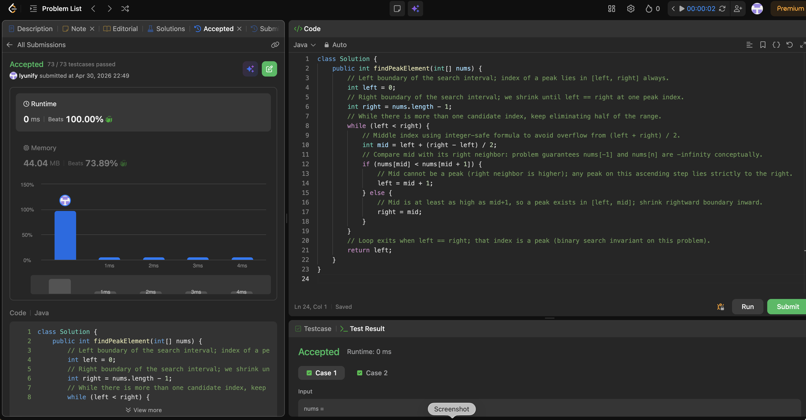

# 162. Find Peak Element

**Difficulty**: Medium<br>
**Primary Tag**: binary-search<br>
**Secondary Tags**: array<br>
**LeetCode Link**: https://leetcode.com/problems/find-peak-element/

---

## Problem Summary

Given an integer array `nums`, find a peak element (one that is strictly greater than its neighbors) and return its index. You may assume `nums[-1] = nums[n] = -∞`. There may be multiple peaks; return any one.

## Screenshot



---

## My Mistake(s)

- Used three-way checks against both `mid - 1` and `mid + 1`, which duplicated boundary logic and made off-by-one errors easy (e.g., when `mid == 0` or `mid == n - 1`).
- Confused "find maximum index" with "find any peak"; multiple peaks exist and only one index is required.
- Sometimes wrote `(left + right) / 2` instead of `left + (right - left) / 2` out of habit from other languages where overflow is less visible — prefer the safe form in Java.
- Initially doubted shrinking with `right = mid` instead of `mid - 1`; missed that keeping `mid` preserves the invariant that the remaining interval still contains a peak.

## Key Insight

Treat the array as having implicit −∞ at both ends, so you never run out of neighbors. Binary search does not look for the peak value directly; it uses the **slope** between `mid` and `mid + 1`:
- If `nums[mid] < nums[mid + 1]`, you are on an upward segment — any peak lies strictly to the right, so move `left = mid + 1`.
- Otherwise `mid` is at least as high as the right neighbor, so a peak exists in `[left, mid]` — move `right = mid`.

When `left == right`, that index is guaranteed to be a peak because at every step you kept the half that must contain one.

## Correct Approach

1. Initialize `left = 0`, `right = n - 1`.
2. While `left < right`:
   - Compute `mid = left + (right - left) / 2`.
   - If `nums[mid] < nums[mid + 1]`: `left = mid + 1` (ascending slope, peak is to the right).
   - Else: `right = mid` (mid is a local high point candidate, keep it).
3. Return `left` (equals `right` at termination).

```java
class Solution {
    public int findPeakElement(int[] nums) {
        int left = 0;
        int right = nums.length - 1;
        while (left < right) {
            int mid = left + (right - left) / 2;
            if (nums[mid] < nums[mid + 1]) {
                left = mid + 1;
            } else {
                right = mid;
            }
        }
        return left;
    }
}
```

**Time Complexity**: O(log n)<br>
**Space Complexity**: O(1)

---

## Practice History

| Date | Outcome | Notes |
|------|---------|-------|
| 2026-04-30 | ✅ Solved after review | Three-way boundary checks caused off-by-ones; key: use slope (mid vs mid+1) and shrink with right=mid |
