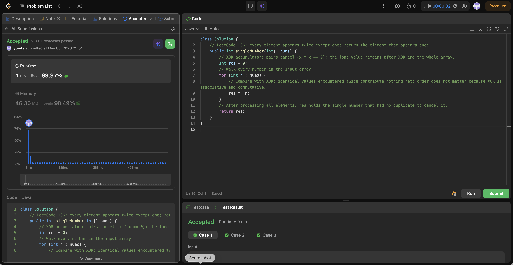

# 136. Single Number

**Difficulty**: Easy<br>
**Primary Tag**: bit-manipulation<br>
**Secondary Tags**: array<br>
**LeetCode Link**: https://leetcode.com/problems/single-number/

---

## Problem Summary

Given a non-empty array of integers where every element appears twice except for one, find and return the element that appears only once. Must run in O(n) time and O(1) extra space.

## Screenshot



---

## My Mistake(s)

- Reaching for hash sets or sorting first and missing the XOR trick entirely.
- Doubting that "order does not matter" and second-guessing XOR's associativity/commutativity.
- Assuming the pattern generalizes: XOR solves the "all twice except one" case but not "all three times except one" — that variant requires a different approach (bit state machine / `ones`+`twos`).
- Mixing up `^` with `&` or `|` when tired.

## Key Insight

XOR the entire array. Because `a ^ a == 0` and `a ^ 0 == a`, every duplicated value cancels regardless of order (XOR is associative and commutative), leaving only the singleton. Time O(n), space O(1).

## Correct Approach

Initialize `res = 0`, then XOR every element into it. Paired values cancel to 0; the lone value survives.

```java
public int singleNumber(int[] nums) {
    int res = 0;
    for (int n : nums) {
        res ^= n;
    }
    return res;
}
```

**Time Complexity**: O(n)<br>
**Space Complexity**: O(1)

---

## Practice History

| Date | Outcome | Notes |
|------|---------|-------|
| 2026-05-03 | ✅ Solved after review | Applied XOR cancellation correctly; noted the trick does not generalize to the "×3 except one" variant |
