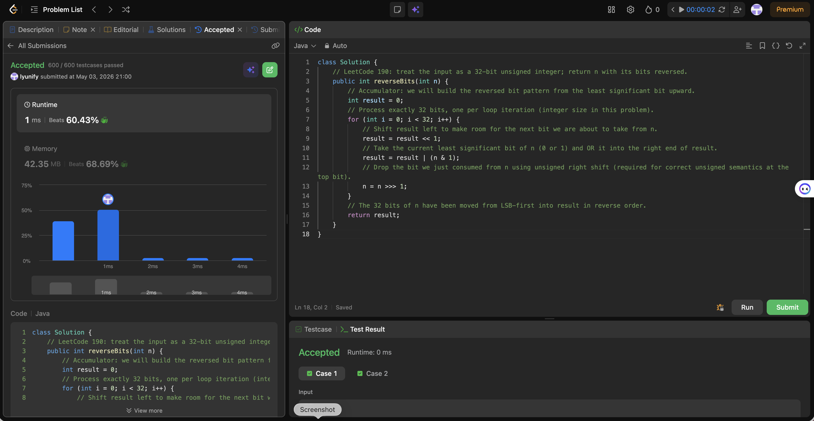

# 190. Reverse Bits

**Difficulty**: Easy<br>
**Primary Tag**: bit-manipulation<br>
**Secondary Tags**: <!-- none --><br>
**LeetCode Link**: https://leetcode.com/problems/reverse-bits/

---

## Problem Summary

Reverse the bits of a given 32-bit unsigned integer and return the result as an unsigned 32-bit integer.

## Screenshot



---

## My Mistake(s)

- Used signed right shift `>>` instead of unsigned right shift `>>>` in Java, causing wrong answers when the original value had a 1 in the most significant bit (sign extension corrupts the remaining bits).
- Wrote a string-based version that rebuilt the answer from character positions, which introduced off-by-one errors at indices and unnecessary allocation.

## Key Insight

Reverse the 32-bit pattern by repeatedly taking the least significant bit of `n` with `n & 1`, shifting `result` left to make room, and OR-ing that bit onto `result`; advance `n` with unsigned right shift `n >>> 1` so all 32 positions behave like an unsigned value, including the top bit. This is O(32) time and O(1) extra space, staying entirely in bit operations—no string or array of characters.

## Correct Approach

Loop exactly 32 times. Each iteration:
1. Shift `result` left by 1 to make room for the next bit.
2. OR the least significant bit of `n` (`n & 1`) into `result`.
3. Unsigned-right-shift `n` by 1 (`n >>> 1`) to consume that bit.

Return `result`.

```java
public int reverseBits(int n) {
    int result = 0;
    for (int i = 0; i < 32; i++) {
        result = result << 1;
        result = result | (n & 1);
        n = n >>> 1;
    }
    return result;
}
```

**Time Complexity**: O(1) — exactly 32 iterations<br>
**Space Complexity**: O(1)

---

## Practice History

| Date | Outcome | Notes |
|------|---------|-------|
| 2026-05-03 | ✅ Solved after review | Used `>>>` correctly; recognized string-based approach is inferior to bit-by-bit accumulation |
