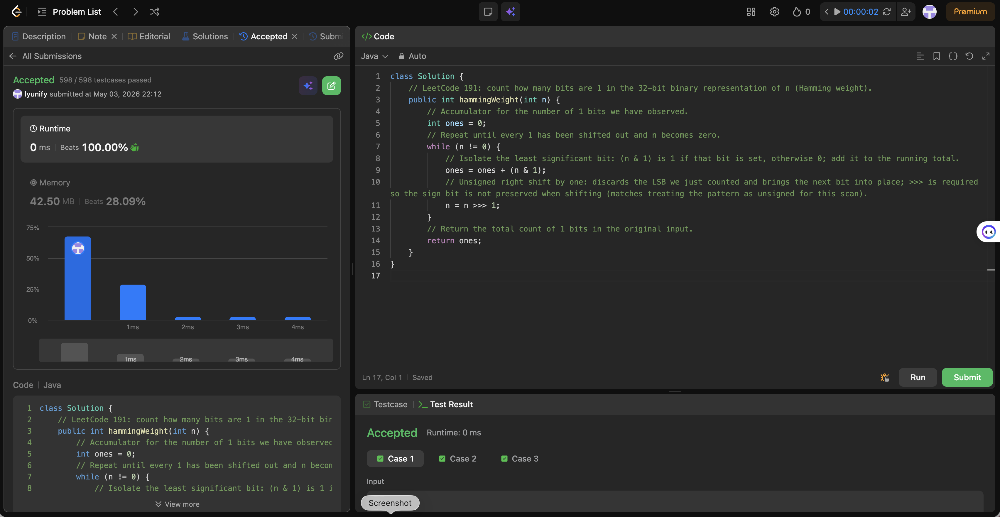

# 191. Number of 1 Bits

**Difficulty**: Easy<br>
**Primary Tag**: bit-manipulation<br>
**Secondary Tags**: <!-- none --><br>
**LeetCode Link**: https://leetcode.com/problems/number-of-1-bits/

---

## Problem Summary

Given a positive integer `n`, return the number of set bits (1s) in its 32-bit binary representation (also known as the Hamming weight).

## Screenshot



---

## My Mistake(s)

- Confusing `>>` with `>>>`: signed right shift `>>` propagates the sign bit on negative inputs, making a "shift until zero" loop wrong or infinite for values with the top bit set.
- Forgetting Java's `int` is signed—the problem's "unsigned" view is about the 32 bits, not a different type. The fix is `>>>` for a logical (unsigned) right shift.
- Using a fixed 32-iteration loop without `>>>` and then mishandling the top bit; the correct choice is either 32 iterations with proper masking or `>>>` in a `while (n != 0)` loop, applied consistently.

## Key Insight

Use `(n & 1)` to read only the least significant bit and add it to the count, then `n >>> 1` so zeros fill from the left and the loop terminates when all 1s are shifted out. An alternative is **Brian Kernighan's trick**: `n &= (n - 1)` strips the lowest set bit each iteration and you increment the count until `n == 0`, often requiring fewer iterations when the popcount is small.

## Correct Approach

**Approach 1 — shift and mask (used in submission):**
Loop while `n != 0`. Each iteration, add `n & 1` to the count, then `n >>>= 1`.

**Approach 2 — Brian Kernighan:**
Loop while `n != 0`. Each iteration, `n &= (n - 1)` clears the lowest set bit; increment the count.

```java
// Approach 1: shift and mask
public int hammingWeight(int n) {
    int ones = 0;
    while (n != 0) {
        ones = ones + (n & 1);
        n = n >>> 1;
    }
    return ones;
}

// Approach 2: Brian Kernighan
public int hammingWeight(int n) {
    int ones = 0;
    while (n != 0) {
        n &= (n - 1);
        ones++;
    }
    return ones;
}
```

**Time Complexity**: O(1) — at most 32 iterations<br>
**Space Complexity**: O(1)

---

## Practice History

| Date | Outcome | Notes |
|------|---------|-------|
| 2026-05-03 | ✅ Solved after review | Used `>>>` correctly; noted Brian Kernighan trick as faster alternative |
