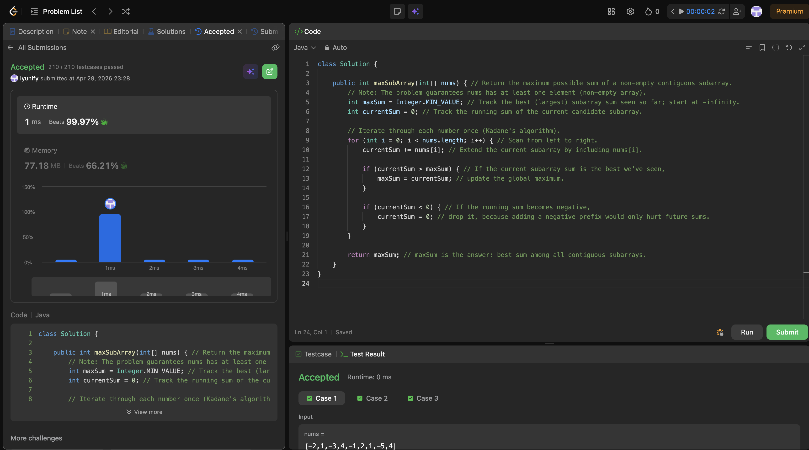

# 53. Maximum Subarray

**Difficulty**: Medium<br>
**Primary Tag**: dynamic-programming<br>
**Secondary Tags**: array, divide-and-conquer<br>
**LeetCode Link**: https://leetcode.com/problems/maximum-subarray/

---

## Problem Summary

Given an integer array `nums`, find the contiguous subarray with the largest sum and return that sum. The subarray must contain at least one element.

## Screenshot



---

## My Mistake(s)

- Wrote C++ syntax (`vector<int>`, `INT_MIN`, `public:`) inside a Java file; it won't compile in Java even though the algorithm idea is correct.
- Initializing `maxSum` to `0` instead of `Integer.MIN_VALUE` fails the all-negatives case, returning `0` instead of the correct (negative) maximum.

## Key Insight

Kadane's algorithm keeps a running `currentSum` for the best subarray ending at the current index, and a `maxSum` for the best overall answer. If `currentSum` goes negative, reset it to `0` — a negative prefix only hurts any future subarray. Initialize `maxSum` to `Integer.MIN_VALUE` so the algorithm handles arrays where all numbers are negative.

## Correct Approach

1. Initialize `maxSum = Integer.MIN_VALUE`, `currentSum = 0`.
2. For each element, add it to `currentSum`.
3. Update `maxSum = max(maxSum, currentSum)`.
4. If `currentSum < 0`, reset `currentSum = 0`.
5. Return `maxSum`.

```java
class Solution {
    public int maxSubArray(int[] nums) {
        int maxSum = Integer.MIN_VALUE;
        int currentSum = 0;

        for (int i = 0; i < nums.length; i++) {
            currentSum += nums[i];

            if (currentSum > maxSum) {
                maxSum = currentSum;
            }

            if (currentSum < 0) {
                currentSum = 0;
            }
        }

        return maxSum;
    }
}
```

**Time Complexity**: O(n)<br>
**Space Complexity**: O(1)

---

## Practice History

| Date | Outcome | Notes |
|------|---------|-------|
| 2026-04-29 | ✅ Solved after review | Used C++ syntax in Java; initialized maxSum to 0 instead of MIN_VALUE |
