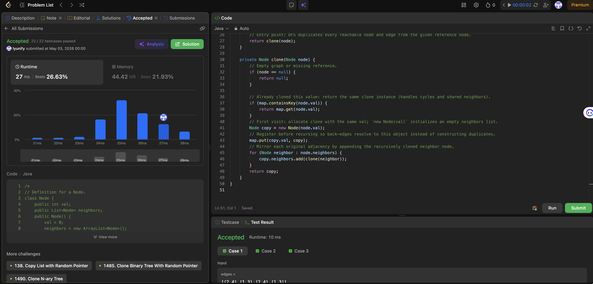

# 133. Clone Graph

**Difficulty**: Medium<br>
**Primary Tag**: graph<br>
**Secondary Tags**: hash-table, depth-first-search, breadth-first-search<br>
**LeetCode Link**: https://leetcode.com/problems/clone-graph/

---

## Problem Summary

Given a reference to a node in a connected undirected graph, return a deep copy (clone) of the graph. Each node contains an integer value and a list of its neighbors.

## Screenshot



---

## My Mistake(s)

- Forgot to insert the new clone into the map **before** iterating neighbors, causing infinite recursion on any cycle.
- Built a completely new neighbor graph without reusing mapped clones, duplicating nodes that appeared multiple times through different edges.
- Used only the original node object identity as key without a map when labels were meant to be unique — still risky if the API changes to duplicate labels; need to know whether the template keys by reference or label.
- Mixed up directed versus undirected cloning — each neighbor relationship appears twice in adjacency lists, but cloning edges once per directed arc from DFS still reconstructs the structure correctly when map reuse is correct.
- Attempted BFS but confused dequeue order with when to add neighbors before memo entries.
- Confused "clone neighbors then put in map" ordering — correct order is: **create shell → map → recurse neighbors**.

## Key Insight

Cloning an undirected graph is DFS/BFS plus a map from each original node to its new node. You must register the clone in the map **before** filling neighbors so that when an edge leads back to an already-seen vertex, recursion returns the memoized clone instead of allocating again — this breaks cycles and preserves shared structure. Neighbors are wired by recursively cloning each adjacent node and appending the returned clone to the current clone's list. DFS and BFS both work; complexity is O(V + E) time and O(V) extra space for the map and recursion stack.

## Correct Approach

1. If `node` is null, return null.
2. If `node.val` is already in the map, return `map.get(node.val)` (handles cycles and shared nodes).
3. Create `copy = new Node(node.val)` — an empty shell with no neighbors yet.
4. Put `copy` into the map immediately: `map.put(copy.val, copy)`.
5. For each neighbor of `node`, recursively clone it and append the result to `copy.neighbors`.
6. Return `copy`.

```java
class Solution {
    private Map<Integer, Node> map = new HashMap<>();

    public Node cloneGraph(Node node) {
        return clone(node);
    }

    private Node clone(Node node) {
        if (node == null) return null;
        if (map.containsKey(node.val)) return map.get(node.val);

        Node copy = new Node(node.val);
        map.put(copy.val, copy);           // register BEFORE recursing
        for (Node neighbor : node.neighbors) {
            copy.neighbors.add(clone(neighbor));
        }
        return copy;
    }
}
```

**Time Complexity**: O(V + E)<br>
**Space Complexity**: O(V) — map + recursion stack

---

## Practice History

| Date | Outcome | Notes |
|------|---------|-------|
| 2026-05-02 | Solved after review | Forgot map-before-recurse ordering; confused directed vs undirected cloning |
