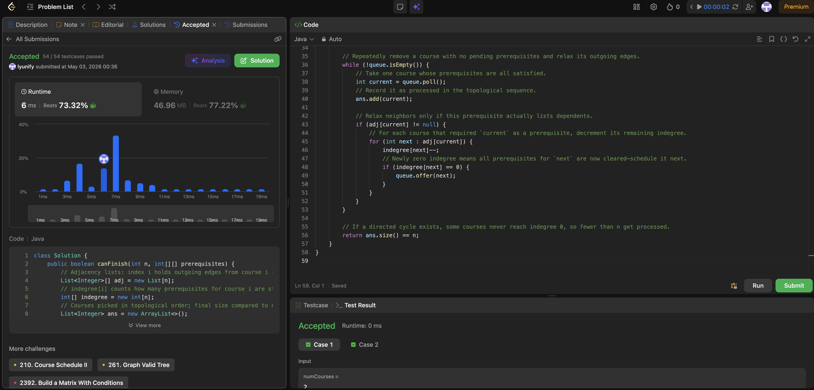

# 207. Course Schedule

**Difficulty**: Medium<br>
**Primary Tag**: graph<br>
**Secondary Tags**: topological-sort, breadth-first-search, depth-first-search<br>
**LeetCode Link**: https://leetcode.com/problems/course-schedule/

---

## Problem Summary

Given `n` courses and a list of prerequisite pairs `[a, b]` (meaning take `b` before `a`), determine whether it is possible to finish all courses — i.e., whether the prerequisite graph is a DAG (no cycles).

## Screenshot



---

## My Mistake(s)

- Reversed the edge direction: for `[a, b]` the edge should be `b → a` (b unlocks a), not `a → b`. Also incremented the wrong indegree as a result.
- Confused this with "number of ways" or used DFS without a clear 0/1/2 visited-state, leading to wrong cycle detection.
- Used a counter but forgot to increment it when popping from the queue — off-by-one in the final check.
- Returned `true` when `ans.size() > 0` instead of `== n`.
- In BFS, enqueued neighbors regardless of indegree, instead of only enqueuing when `indegree[next] == 0`.
- Did not null-check `adj[current]` for courses with no outgoing edges.
- Compared result against `prerequisites.length` (number of edges) instead of `n` (number of courses).

## Key Insight

"Can finish all courses" is equivalent to the prerequisite graph being a **DAG**. Use Kahn's BFS (topological sort):

1. Build adjacency list with edges `b → a` for each `[a, b]`, and track `indegree[a]`.
2. Seed the queue with all nodes where `indegree == 0` (no prerequisites).
3. Dequeue a node, add to result, and decrement indegree of all its neighbors; enqueue any neighbor whose indegree drops to 0.
4. If `ans.size() == n`, no cycle exists — all courses can be finished.

Intuition: any node in a cycle always has at least one unresolved incoming edge, so it never reaches indegree 0 and is never processed.

## Correct Approach

```java
class Solution {
    public boolean canFinish(int n, int[][] prerequisites) {
        List<Integer>[] adj = new List[n];
        int[] indegree = new int[n];
        List<Integer> ans = new ArrayList<>();

        for (int[] pair : prerequisites) {
            int a = pair[0], b = pair[1]; // take b before a → edge b → a
            if (adj[b] == null) adj[b] = new ArrayList<>();
            adj[b].add(a);
            indegree[a]++;
        }

        Queue<Integer> queue = new LinkedList<>();
        for (int i = 0; i < n; i++) {
            if (indegree[i] == 0) queue.offer(i);
        }

        while (!queue.isEmpty()) {
            int current = queue.poll();
            ans.add(current);
            if (adj[current] != null) {
                for (int next : adj[current]) {
                    indegree[next]--;
                    if (indegree[next] == 0) queue.offer(next);
                }
            }
        }

        return ans.size() == n;
    }
}
```

**Time Complexity**: O(V + E)<br>
**Space Complexity**: O(V + E)

---

## Practice History

| Date | Outcome | Notes |
|------|---------|-------|
| 2026-05-02 | Solved after review | Reversed edge direction; compared against prerequisites.length instead of n |
