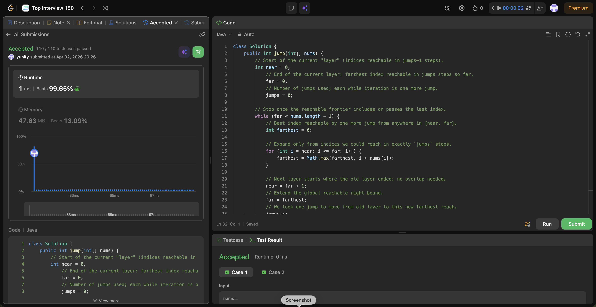

# 45. Jump Game II

**Difficulty**: Medium<br>
**Primary Tag**: greedy<br>
**Secondary Tags**: array, dynamic-programming<br>
**LeetCode Link**: https://leetcode.com/problems/jump-game-ii/

---

## Problem Summary

Given an integer array `nums` where `nums[i]` is the maximum jump length from index `i`, return the minimum number of jumps to reach the last index (always reachable).

## Screenshot



---

## My Mistake(s)

- **Confusing with Jump Game I**: Problem I only needs feasibility (single running `maxReach`). Problem II needs counting jumps, so you must expand by layers (BFS); naively reusing the I-style scan while incrementing a counter often gives the wrong count.
- **O(n²) DP mindset**: For each position, scanning all prior positions that can reach it works but is too slow; the greedy layer trick is the standard linear solution.
- **Wrong inner loop range**: Using `i <= far` starting from the correct `near` is crucial; iterating the whole array each time, or mixing "old" and "new" `far` while computing `farthest`, breaks the layer semantics.
- **Update order bugs**: Compute the full `farthest` for the current layer before setting `far = farthest` and `jumps++`. Updating `far` while still iterating the same layer can let one "jump" benefit from positions that should belong to the next jump.

## Key Insight

Treat each jump count as a BFS layer. From every index reachable in exactly `k` jumps (the window `[near, far]`), find the farthest index reachable in one more jump — that is the next layer's right boundary. This is BFS on an implicit graph, implemented greedily in O(n) time and O(1) space. The next layer always starts at `far + 1` (no overlap, no visited array needed). If `nums.length == 1`, the while body never runs and the answer correctly stays 0.

## Correct Approach

1. Initialize `near = 0`, `far = 0`, `jumps = 0`.
2. While `far < nums.length - 1` (last index not yet within reach):
   - Compute `farthest = max(i + nums[i])` for all `i` in `[near, far]`.
   - Advance to the next layer: `near = far + 1`, `far = farthest`, `jumps++`.
3. Return `jumps`.

```java
class Solution {
    public int jump(int[] nums) {
        int near = 0, far = 0, jumps = 0;
        while (far < nums.length - 1) {
            int farthest = 0;
            for (int i = near; i <= far; i++) {
                farthest = Math.max(farthest, i + nums[i]);
            }
            near = far + 1;
            far = farthest;
            jumps++;
        }
        return jumps;
    }
}
```

**Time Complexity**: O(n)<br>
**Space Complexity**: O(1)

---

## Practice History

| Date | Outcome | Notes |
|------|---------|-------|
| 2026-04-02 | Solved after review | Needed layered BFS/greedy insight; confused with Jump Game I approach initially |
