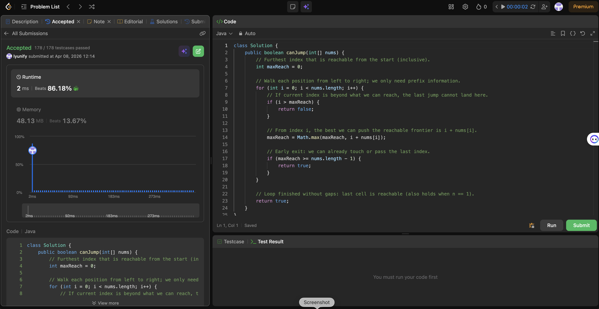

# 55. Jump Game

**Difficulty**: Medium<br>
**Primary Tag**: greedy<br>
**Secondary Tags**: array, dynamic-programming<br>
**LeetCode Link**: https://leetcode.com/problems/jump-game/

---

## Problem Summary

Given an integer array `nums` where `nums[i]` is the maximum jump length from index `i`, determine if you can reach the last index starting from index 0.

## Screenshot



---

## My Mistake(s)

- **DFS without memo / exponential branching**: Trying all jump lengths from every index blows up; the greedy "max reachable" view avoids that.
- **Wrong loop bound**: Stopping the loop at `maxReach` only works if you phrase the invariant carefully; the usual safe pattern is to iterate `i` over `[0, n)` and break when unreachable.
- **Off-by-one on the goal**: The last index is `n-1`; compare `maxReach >= nums.length - 1`, not `> n`.
- **Forgetting the gap check**: Updating `maxReach` without first checking `i <= maxReach` can incorrectly "borrow" jumps from unreachable cells.

## Key Insight

Maintain the farthest index reachable (`maxReach`) from all positions `0..i`. If you ever reach an index `i > maxReach`, there's a gap — the end is unreachable. From a reachable index `i`, the frontier extends to `i + nums[i]`. Once `maxReach >= n - 1`, you can return `true` immediately.

## Correct Approach

1. Initialize `maxReach = 0`.
2. Iterate `i` from `0` to `n - 1`:
   - If `i > maxReach`, return `false` (gap encountered).
   - Update `maxReach = Math.max(maxReach, i + nums[i])`.
   - If `maxReach >= n - 1`, return `true` (goal reached).
3. Return `true` (loop finished without a gap).

```java
class Solution {
    public boolean canJump(int[] nums) {
        int maxReach = 0;
        for (int i = 0; i < nums.length; i++) {
            if (i > maxReach) {
                return false;
            }
            maxReach = Math.max(maxReach, i + nums[i]);
            if (maxReach >= nums.length - 1) {
                return true;
            }
        }
        return true;
    }
}
```

**Time Complexity**: O(n)<br>
**Space Complexity**: O(1)

---

## Practice History

| Date | Outcome | Notes |
|------|---------|-------|
| 2026-04-02 | Solved after review | Needed to recall greedy frontier trick; off-by-one and gap-check pitfalls noted |
| 2026-04-08 | Solved after review | DP overkill again; reconfirmed frontier invariant and gap check; early exit on maxReach >= lastIndex |
