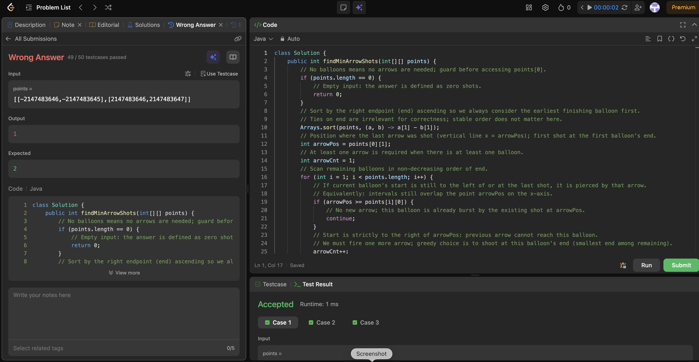

# 452. Minimum Number of Arrows to Burst Balloons

**Difficulty**: Medium<br>
**Primary Tag**: greedy<br>
**Secondary Tags**: array, sorting<br>
**LeetCode Link**: https://leetcode.com/problems/minimum-number-of-arrows-to-burst-balloons/

---

## Problem Summary

Given a set of balloons represented as horizontal intervals `[x_start, x_end]` on a 2D plane, find the minimum number of vertical arrows needed to burst all balloons. An arrow shot at position `x` bursts every balloon whose interval contains `x`.

## Screenshot



---

## My Mistake(s)

- Initially confused "overlap" with sorting by start only, which makes the greedy choice less obvious and harder to reason about.
- Had to be careful with the boundary condition: a balloon is covered by the previous arrow when `lastShot >= start` (after sorting by end), not only when intervals visually "touch".
- Forgetting the empty-input case would cause an `ArrayIndexOutOfBoundsException` on `points[0]` before any loop access.

## Key Insight

Sort balloons by their **right endpoint (end) ascending**, then greedily shoot at the smallest uncovered end. One arrow at position `x` bursts every balloon whose interval contains `x`, so overlapping balloons along the line share one shot. Tracking only the last shot position and comparing it to the next balloon's start implements the "minimum interval covering" idea on a timeline.

## Correct Approach

1. Handle empty input — return 0.
2. Sort `points` by right endpoint ascending (`a[1] - b[1]`).
3. Initialize `arrowPos = points[0][1]`, `arrowCnt = 1`.
4. For each subsequent balloon `i`:
   - If `arrowPos >= points[i][0]`, the current arrow already bursts it — skip.
   - Otherwise, fire a new arrow at `points[i][1]` (the earliest possible end among remaining uncovered balloons), increment `arrowCnt`.
5. Return `arrowCnt`.

```java
class Solution {
    public int findMinArrowShots(int[][] points) {
        if (points.length == 0) return 0;
        Arrays.sort(points, (a, b) -> a[1] - b[1]);
        int arrowPos = points[0][1];
        int arrowCnt = 1;
        for (int i = 1; i < points.length; i++) {
            if (arrowPos >= points[i][0]) {
                continue;
            }
            arrowCnt++;
            arrowPos = points[i][1];
        }
        return arrowCnt;
    }
}
```

> **Note on comparator overflow**: `a[1] - b[1]` can overflow with large negative values (e.g., the failing test `[[-2147483646,-2147483645],[2147483646,2147483647]]`). Use `Integer.compare(a[1], b[1])` in production to avoid this.

**Time Complexity**: O(n log n)<br>
**Space Complexity**: O(1)

---

## Practice History

| Date | Outcome | Notes |
|------|---------|-------|
| 2026-04-18 | ✅ Solved after review | Sorted by end; greedy shoot at earliest end; hit overflow bug with subtraction comparator |
