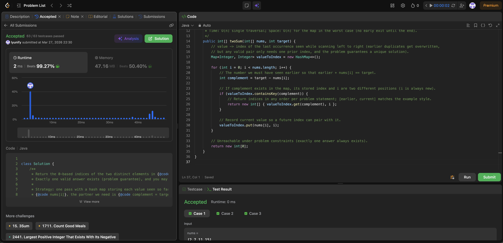

# 1. Two Sum

**Difficulty**: Easy<br>
**Primary Tag**: hash-table<br>
**Secondary Tags**: array<br>
**LeetCode Link**: https://leetcode.com/problems/two-sum/

---

## Problem Summary

Given an array of integers `nums` and an integer `target`, return the indices of the two numbers that add up to `target`.

## Screenshot



---

## My Mistake(s)

<!-- What went wrong during your attempt. Be specific. -->

## Key Insight

Use a hash map to store each number and its index as you iterate. For each new number, check if its complement (`target - value`) already exists in the map. If so, you've found the answer in a single pass.

## Correct Approach

1. Initialize an empty hash map `records`.
2. Iterate through `nums` with `enumerate`.
3. Compute `remain = target - value`.
4. If `remain` is in `records`, return `[records[remain], index]`.
5. Otherwise, store `records[value] = index` and continue.

```python
class Solution(object):
    def twoSum(self, nums, target):
        records = {}
        for index, value in enumerate(nums):
            remain = target - value
            if remain in records:
                return [records[remain], index]
            records[value] = index
```

**Time Complexity**: O(n)<br>
**Space Complexity**: O(n)<br>

---

## Practice History

| Date | Outcome | Notes |
|------|---------|-------|
| 2026-03-21 | ✅ | Accepted — 2 ms, beats 57.26% runtime; 12.88 MB, beats 97.57% memory |
