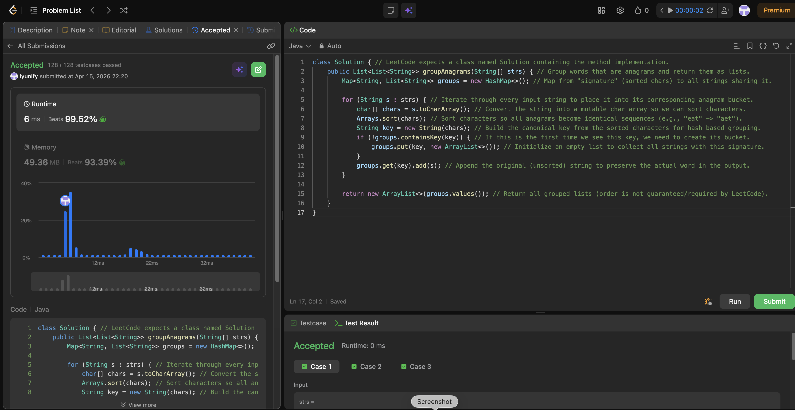

# 49. Group Anagrams

**Difficulty**: Medium<br>
**Primary Tag**: hash-table<br>
**Secondary Tags**: string, sorting<br>
**LeetCode Link**: https://leetcode.com/problems/group-anagrams/

---

## Problem Summary

Given an array of strings, group the anagrams together and return a list of groups (order of groups and within groups does not matter).

## Screenshot



---

## My Mistake(s)

### 2026-04-15

- **Returned sorted strings instead of originals.** Mixed up "sorted string" (the key/signature) with "original string" (the value to store), causing the output to contain sorted versions instead of the actual input words.
- **Forgot bucket initialization.** Hash lookups on a new key return null; accessing `groups.get(key).add(s)` without first creating a new list causes a NullPointerException. Must check `containsKey` and initialize before appending.
- **Overlooked the time trade-off.** Sorting each string costs O(k log k) per string; a frequency-count key (e.g., `int[26]` encoded as a string) would be O(k) per string if constraints required it.

## Key Insight

### 2026-04-15

- **Canonical signature = sorted characters.** All anagrams produce the same sorted string (e.g., `"eat"`, `"tea"`, `"ate"` → `"aet"`), making it a natural grouping key.
- **One-pass grouping with a map.** Use `Map<String, List<String>>`: compute the key for each string, initialize the bucket on first sight, then append the original string.
- **Output order is irrelevant.** `new ArrayList<>(map.values())` is sufficient — no sorting of the result needed.

## Correct Approach

1. Initialize `Map<String, List<String>> groups = new HashMap<>()`.
2. For each string `s` in `strs`:
   - Convert to `char[]`, sort, build `key = new String(chars)`.
   - If `key` not in map, put a new empty list.
   - Append original `s` to `groups.get(key)`.
3. Return `new ArrayList<>(groups.values())`.

```java
class Solution {
    public List<List<String>> groupAnagrams(String[] strs) {
        Map<String, List<String>> groups = new HashMap<>();

        for (String s : strs) {
            char[] chars = s.toCharArray();
            Arrays.sort(chars);
            String key = new String(chars);
            if (!groups.containsKey(key)) {
                groups.put(key, new ArrayList<>());
            }
            groups.get(key).add(s);
        }

        return new ArrayList<>(groups.values());
    }
}
```

**Time Complexity**: O(n · k log k) where n = number of strings, k = max string length<br>
**Space Complexity**: O(n · k)

---

## Practice History

| Date | Outcome | Notes |
|------|---------|-------|
| 2026-04-15 | Solved after review | Returned sorted keys instead of originals; forgot bucket init; missed frequency-count key as faster alternative |
