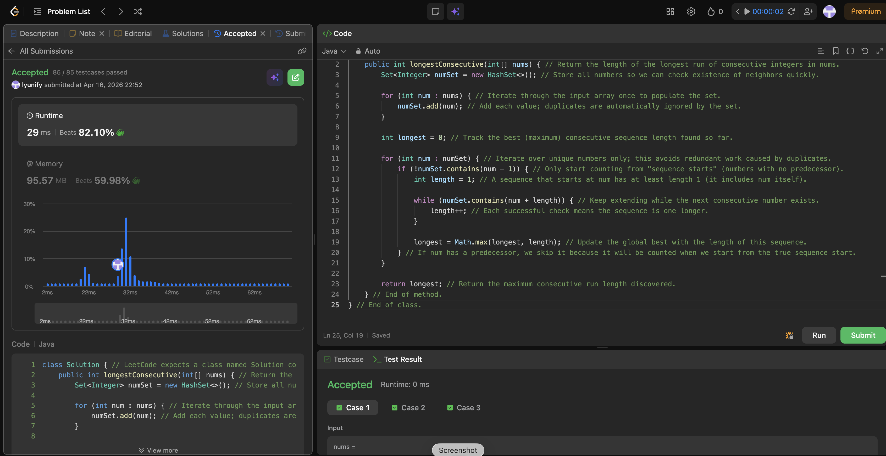

# 128. Longest Consecutive Sequence

**Difficulty**: Medium<br>
**Primary Tag**: hash-table<br>
**Secondary Tags**: array<br>
**LeetCode Link**: https://leetcode.com/problems/longest-consecutive-sequence/

---

## Problem Summary

Given an unsorted array of integers, return the length of the longest sequence of consecutive integers. Must run in O(n) time.

## Screenshot



---

## My Mistake(s)

- Expanding from every number instead of only sequence starts, which degrades toward O(n²) on long consecutive runs.
- Forgetting the "start condition" (`!contains(num - 1)`), then wondering why performance is bad.
- Reaching for sorting first (O(n log n)) when the intended optimal approach is O(n) with hashing.

## Key Insight

Only expand a sequence from a true start — a number whose predecessor (`num - 1`) is not in the set. This ensures each sequence is counted exactly once and keeps total work O(n). A HashSet makes existence checks O(1) average, and iterating over the set (not the array) avoids redundant work from duplicates.

## Correct Approach

1. Add all numbers to a `HashSet`.
2. Iterate over unique numbers in the set.
3. For each `num` where `num - 1` is **not** in the set (i.e., it's a sequence start), expand: count `num+1`, `num+2`, … as long as they exist.
4. Track the maximum length found.

```java
class Solution {
    public int longestConsecutive(int[] nums) {
        Set<Integer> numSet = new HashSet<>();
        for (int num : nums) numSet.add(num);

        int longest = 0;
        for (int num : numSet) {
            if (!numSet.contains(num - 1)) {
                int length = 1;
                while (numSet.contains(num + length)) length++;
                longest = Math.max(longest, length);
            }
        }
        return longest;
    }
}
```

**Time Complexity**: O(n)<br>
**Space Complexity**: O(n)

---

## Practice History

| Date | Outcome | Notes |
|------|---------|-------|
| 2026-04-16 | Solved after review | Missed start-condition check; defaulted to sorting instead of HashSet O(n) approach |
