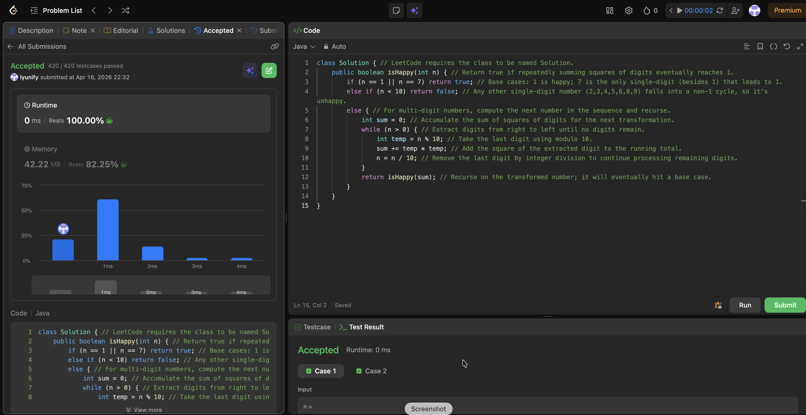

# 202. Happy Number

**Difficulty**: Easy<br>
**Primary Tag**: hash-table<br>
**Secondary Tags**: math, two-pointers<br>
**LeetCode Link**: https://leetcode.com/problems/happy-number/

---

## Problem Summary

Determine whether a number is "happy" by repeatedly replacing it with the sum of squares of its digits — a number is happy if this process eventually reaches 1, and unhappy if it loops forever.

## Screenshot



---

## My Mistake(s)

- Relied on "magic" base cases (like 7) without clearly justifying why they work, making the solution feel less rigorous.
- Didn't use a general cycle-detection approach (e.g., HashSet or fast-slow pointers), so forgetting the single-digit rule could lead to uncertainty about correctness.
- Initially underestimated how important it is to explicitly handle the single-digit boundary; without it, the recursion logic is harder to prove.

## Key Insight

This problem is fundamentally about detecting whether the sequence n → Σ(digit²) reaches 1 or enters a cycle. A practical shortcut: once n is a single digit, only 1 and 7 can still reach 1 — all other single digits are guaranteed to be in the unhappy cycle. The digit-square transform is implemented by repeatedly taking `n % 10`, squaring it, and shrinking `n /= 10`. The more general approach uses a HashSet to detect any repeated value (cycle detection).

## Correct Approach

**Approach 1 — Single-digit base cases (recursive):**
- Base cases: return `true` if `n == 1` or `n == 7`; return `false` if `n < 10` (any other single digit is in the unhappy cycle).
- Otherwise, compute the sum of squares of digits and recurse.

**Approach 2 — HashSet cycle detection (general):**
- Use a `HashSet<Integer>` to track seen values.
- Each step, compute the digit-square sum; if it equals 1, return `true`; if it's already in the set, return `false` (cycle detected); otherwise add it and continue.

```java
// Approach 1: single-digit base cases
class Solution {
    public boolean isHappy(int n) {
        if (n == 1 || n == 7) return true;
        else if (n < 10) return false;
        else {
            int sum = 0;
            while (n > 0) {
                int temp = n % 10;
                sum += temp * temp;
                n /= 10;
            }
            return isHappy(sum);
        }
    }
}

// Approach 2: HashSet cycle detection
class Solution {
    public boolean isHappy(int n) {
        Set<Integer> seen = new HashSet<>();
        while (n != 1) {
            if (seen.contains(n)) return false;
            seen.add(n);
            int sum = 0;
            while (n > 0) {
                int d = n % 10;
                sum += d * d;
                n /= 10;
            }
            n = sum;
        }
        return true;
    }
}
```

**Time Complexity**: O(log n) per step, bounded number of steps<br>
**Space Complexity**: O(1) for Approach 1; O(k) for Approach 2 where k is the cycle length

---

## Practice History

| Date | Outcome | Notes |
|------|---------|-------|
| 2026-04-16 | Solved after review | Used single-digit base cases; need to also know HashSet cycle-detection approach |
