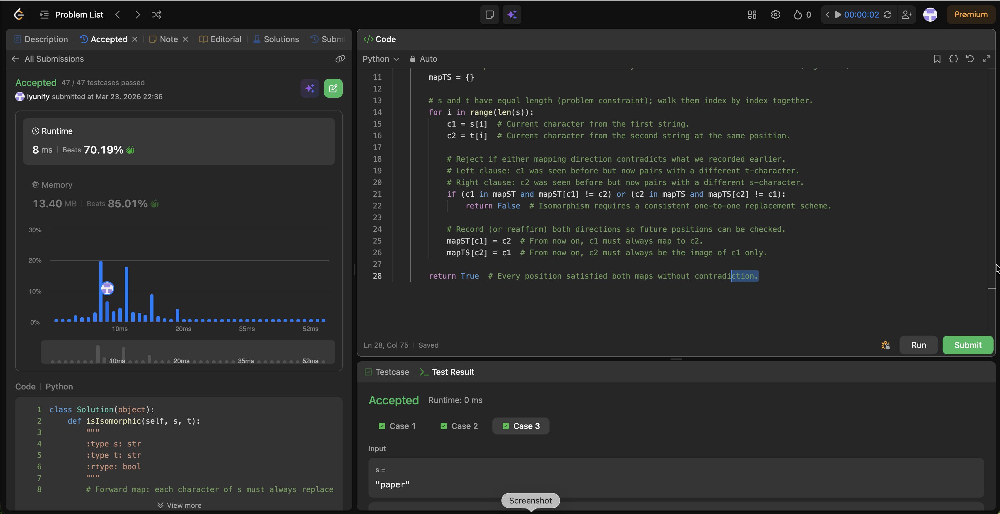

# 205. Isomorphic Strings

**Difficulty**: Easy<br>
**Primary Tag**: hash-table<br>
**Secondary Tags**: string<br>
**LeetCode Link**: https://leetcode.com/problems/isomorphic-strings/

---

## Problem Summary

Given two strings `s` and `t`, determine if they are isomorphic — every character in `s` can be replaced to get `t`, with no two characters mapping to the same character and the mapping is consistent throughout.

## Screenshot



---

## My Mistake(s)

- Used `(c2 in mapTS and mapTS[c2]) != c1` instead of `(c2 in mapTS and mapTS[c2] != c1)`; when `c2` was not in `mapTS`, that became `False != c1` and failed on the first character.
- Omitted `return True` after the loop (returns `None`, which is wrong on LeetCode).
- Misplaced parentheses so `!=` did not compare `mapTS[c2]` to `c1` directly.

## Key Insight

- **What "isomorphic" means**: iso- (same) + morph (shape) — same repetition structure; rename letters in `s` so every copy of one letter becomes one fixed letter in `t`, and two different letters in `s` cannot both map to the same letter in `t` (pattern `XYY` ↔ `egg` ↔ `add`).
- **Isomorphism is a bijection**: need two maps (`s→t` and `t→s`), same idea as Word Pattern — update both each step; one map alone only checks one direction.
- **Debugging tip**: when in doubt, trace iteration 0 with empty maps to catch boolean/precedence bugs.

## Correct Approach

1. Initialize two empty dicts `mapST` and `mapTS`.
2. Loop `for i in range(len(s))`: let `c1 = s[i]`, `c2 = t[i]`.
3. If `(c1 in mapST and mapST[c1] != c2) or (c2 in mapTS and mapTS[c2] != c1)`: return `False`.
4. Record `mapST[c1] = c2` and `mapTS[c2] = c1`.
5. Return `True`.

```python
class Solution:
    def isIsomorphic(self, s: str, t: str) -> bool:
        mapST = {}
        mapTS = {}

        for i in range(len(s)):
            c1 = s[i]
            c2 = t[i]

            if (c1 in mapST and mapST[c1] != c2) or (c2 in mapTS and mapTS[c2] != c1):
                return False

            mapST[c1] = c2
            mapTS[c2] = c1

        return True
```

**Time Complexity**: O(n)<br>
**Space Complexity**: O(1) (at most 26 keys per map for lowercase English letters)

---

## Practice History

| Date | Outcome | Notes |
|------|---------|-------|
| 2026-03-23 | Solved after review | Misplaced parentheses broke boolean check; omitted return True; needed two maps for bijection |
