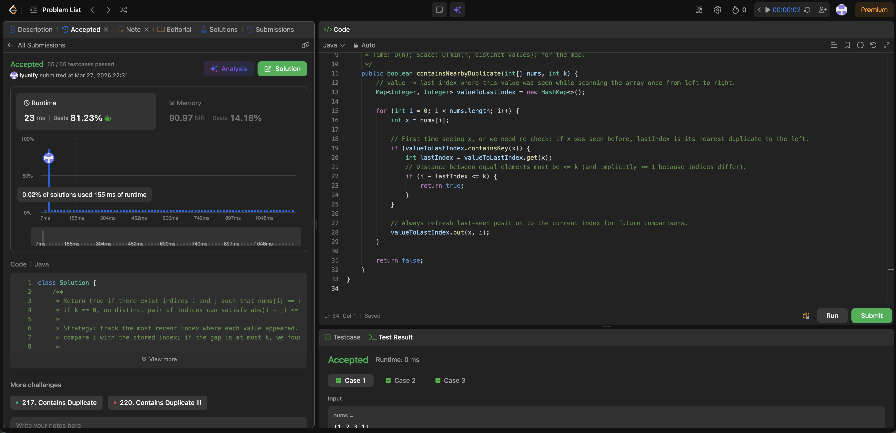

# 219. Contains Nearby Duplicate

**Difficulty**: Easy<br>
**Primary Tag**: hash-table<br>
**Secondary Tags**: array, sliding-window<br>
**LeetCode Link**: https://leetcode.com/problems/contains-duplicate-ii/

---

## Problem Summary

Given an integer array `nums` and an integer `k`, return `true` if there exist two distinct indices `i` and `j` such that `nums[i] == nums[j]` and `abs(i - j) <= k`.

## Screenshot



---

## My Mistake(s)

- Placed `records[value] = index` in the wrong scope, so new values were never added to the map.
- Missed that the dictionary should store the **latest** index of each number (overwrite on each visit).
- Forgot to update the current value's index after each iteration.

### 2026-03-27

- **Confused k with "window size minus one".** The condition is `|i - j| <= k` (distance between indices). Compute `i - lastIndex` (with `i > lastIndex` while scanning forward) and compare directly to `k`.
- **Used a frequency map / set only (no index).** A plain "seen set" answers Contains Duplicate I, not II; you must store the last index to measure distance.
- **Wrong sliding window boundaries.** A fixed window of the last k elements can work, but removing stale indices when a value falls out of the window is easy to get wrong if duplicates are in the multiset. The last-index map approach is simpler.
- **Reset the map too aggressively.** Clearing the entire structure when moving the window breaks the "nearest previous equal value" idea; you only need the most recent index for each value.
- **Edge case k == 0.** No pair of distinct indices can satisfy `|i - j| <= 0`, so the answer must be false. Mis-implementing as `< k` or allowing `i == j` silently makes wrong answers.
- **Brute force (O(nk)) without realizing TLE risk.** Scanning backward up to k steps for every i is worse than the O(n) map; the fix is caching the last position.
- **Compared values at i and i+k only.** Duplicates might be closer than k but not exactly at offset k; you need any prior index within distance k, which the last-seen index captures.

## Key Insight

Record `value → latest index` in a dictionary. On each visit, if the value already exists, check whether `index - records[value] <= k`. Always update the stored index afterwards so it stays current for future comparisons.

### 2026-03-27

- **Reduce to "nearest duplicate":** For each `i`, track `value → lastIndex`; if `i - lastIndex <= k`, return true. Any earlier occurrence of the same value is farther away — if the closest repeat is too far, none of the older ones can help.
- **Alternative sliding window:** Maintain a set of the last k values; on adding `nums[i]`, if it's already in the set, return true; evict `nums[i-k]` when `i >= k`. Time O(n), space O(k).
- **Complexity:** One pass with hash map: time O(n), space O(min(n, distinct values)).

## Correct Approach

1. Initialize an empty hash map `records`.
2. Iterate with `enumerate(nums)`.
3. If `value` is already in `records` and `index - records[value] <= k`, return `True`.
4. Update `records[value] = index` (outside the inner `if`, always at the end of the loop body).
5. If the loop ends without finding a match, return `False`.

```python
class Solution(object):
    def containsNearbyDuplicate(self, nums, k):
        records = {}
        for index, value in enumerate(nums):
            if value in records:
                if index - records[value] <= k:
                    return True
            records[value] = index
        return False
```

**Time Complexity**: O(n)<br>
**Space Complexity**: O(n)

---

## Practice History

| Date | Outcome | Notes |
|------|---------|-------|
| 2026-03-21 | ✅ | Accepted — 20 ms, beats 99.22% runtime; 23.81 MB, beats 89.70% memory |
| 2026-03-27 | Solved after review | Confused k semantics; used seen-set instead of index map; last-index approach is key — nearest occurrence is always the closest, so older ones never help |
