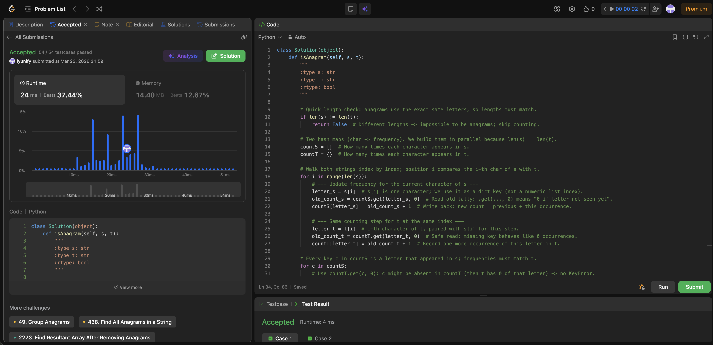

# 242. Valid Anagram

**Difficulty**: Easy<br>
**Primary Tag**: hash-table<br>
**Secondary Tags**: string<br>
**LeetCode Link**: https://leetcode.com/problems/valid-anagram/

---

## Problem Summary

Given two strings `s` and `t`, return `true` if `t` is an anagram of `s`, and `false` otherwise.

## Screenshot



---

## My Mistake(s)

- Mixed up which dictionary to update and which key to use: wrote `countT[s[i]]` and `countS.get(t[i], 0)` instead of updating `countT` with `t[i]` and reading from `countT` for `t`.
- Flipped the final check: used `if countS[c] == countT.get(c, 0): return False` instead of `!=`.
- Did not see `countS[s[i]] = 1 + countS.get(s[i], 0)` as "read old count → add 1 → write back"; the left side is the slot (key = letter), the right side is the new value.
- Confused `[]` on a string (`s[i]` = index) with `[]` on a dict (`countS[letter]` = key); same brackets, different meaning.
- Wondered why it must be `countS.get(...)` not `get(...)` — `.get` is a method on that specific dict; you must say which map you are reading.
- Thought `countT[c]` was fine after the loop, but `c` is only guaranteed to be a key in `countS`; if `t` never had that letter, `countT[c]` raises `KeyError` — need `countT.get(c, 0)`.
- Was unclear what `c` is in `for c in countS`: in Python, iterating a dict gives keys — each `c` is a letter that appeared in `s`.
- Overloaded on names (`letter_s`, `old_count_s`, `i`) until separating: `i` = position, `s[i]` / `letter_s` = character, `countS[...]` = frequency table.

## Key Insight

- Anagram ⟺ same multiset of characters ⟺ same length and same per-letter counts.
- Build `countS` and `countT` in one pass (same index `i` for `s[i]` and `t[i]`).
- To compare, loop `for c in countS` and check `countS[c] != countT.get(c, 0)`: `.get(c, 0)` means "zero occurrences in `t` if the key is missing," avoiding `KeyError` and catching different letter sets.
- `dict.get(key, default)` is for safe reads when the key might not exist yet.

## Correct Approach

1. If `len(s) != len(t)`, return `False` immediately.
2. Initialize two empty dicts `countS` and `countT`.
3. Loop `for i in range(len(s))`: increment `countS[s[i]]` and `countT[t[i]]` using `.get(..., 0) + 1`.
4. Loop `for c in countS`: if `countS[c] != countT.get(c, 0)`, return `False`.
5. Return `True`.

```python
class Solution:
    def isAnagram(self, s: str, t: str) -> bool:
        if len(s) != len(t):
            return False

        countS, countT = {}, {}

        for i in range(len(s)):
            countS[s[i]] = 1 + countS.get(s[i], 0)
            countT[t[i]] = 1 + countT.get(t[i], 0)

        for c in countS:
            if countS[c] != countT.get(c, 0):
                return False

        return True
```

**Time Complexity**: O(n)<br>
**Space Complexity**: O(1) (at most 26 keys for lowercase English letters)

---

## Practice History

| Date | Outcome | Notes |
|------|---------|-------|
| 2026-03-23 | Solved after review | Mixed up dict/key assignments, flipped != check, confused KeyError on countT[c] |
