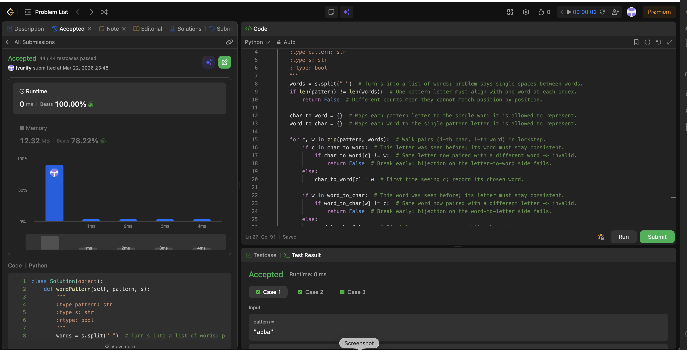

# 290. Word Pattern

**Difficulty**: Easy<br>
**Primary Tag**: hash-table<br>
**Secondary Tags**: string<br>
**LeetCode Link**: https://leetcode.com/problems/word-pattern/

---

## Problem Summary

Given a `pattern` string and a string `s` of space-separated words, return `true` if `s` follows the same bijection (one-to-one correspondence) as `pattern` — each letter maps to exactly one word and each word maps back to exactly one letter.

## Screenshot



---

## My Mistake(s)

- Did not understand what bijection meant at first.
- Was unsure which approach to use.

## Key Insight

Use two hash maps to enforce a one-to-one mapping in both directions: one maps each pattern character to its word, and another maps each word back to its pattern character. If any existing mapping is inconsistent, return false immediately.

## Correct Approach

1. Split `s` into words. If `len(pattern) != len(words)`, return `False`.
2. Use `char_to_word` and `word_to_char` dictionaries.
3. Iterate over `zip(pattern, words)`. For each pair `(c, w)`:
   - If `c` is already mapped, verify it maps to `w`; if not, return `False`.
   - If `w` is already mapped, verify it maps to `c`; if not, return `False`.
   - Otherwise, record both mappings.
4. Return `True`.

```python
class Solution(object):
    def wordPattern(self, pattern, s):
        words = s.split(" ")  # Turn s into a list of words; problem says single spaces between words.
        if len(pattern) != len(words):  # One pattern letter must align with one word at each index.
            return False  # Different counts mean they cannot match position by position.

        char_to_word = {}  # Maps each pattern letter to the single word it is allowed to represent.
        word_to_char = {}  # Maps each word to the single pattern letter it is allowed to represent.

        for c, w in zip(pattern, words):  # Walk pairs (i-th char, i-th word) in lockstep.
            if c in char_to_word:  # This letter was seen before; its word must stay consistent.
                if char_to_word[c] != w:  # Same letter now paired with a different word -> invalid.
                    return False  # Break early: bijection on the letter-to-word side fails.
            else:
                char_to_word[c] = w  # First time seeing c; record its chosen word.

            if w in word_to_char:  # This word was seen before; its letter must stay consistent.
                if word_to_char[w] != c:  # Same word now paired with a different letter -> invalid.
                    return False  # Break early: bijection on the word-to-letter side fails.
            else:
                word_to_char[w] = c  # First time seeing w; record its chosen letter.

        return True  # All pairs passed both bijection checks.
```

**Time Complexity**: O(n) where n is the number of words<br>
**Space Complexity**: O(n) for the two hash maps

---

## Practice History

| Date | Outcome | Notes |
|------|---------|-------|
| 2026-03-22 | Solved after review | Unclear on bijection concept; used two hash maps to enforce one-to-one mapping in both directions |
