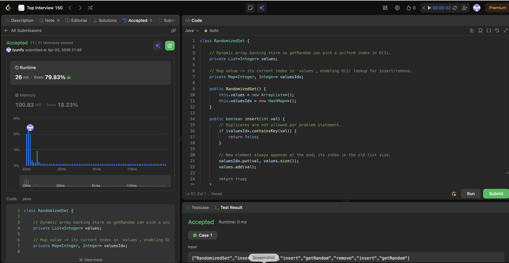

# 380. Insert Delete GetRandom O(1)

**Difficulty**: Medium<br>
**Primary Tag**: hash-table<br>
**Secondary Tags**: array, math, design, randomized<br>
**LeetCode Link**: https://leetcode.com/problems/insert-delete-getrandom-o1/

---

## Problem Summary

Design a data structure that supports insert, remove, and getRandom in average O(1) time, where getRandom returns each element with equal probability.

## Screenshot



---

## My Mistake(s)

- **Using only a list or only a map**: List alone gives O(n) delete by value; map alone has no O(1) way to draw a uniformly random element without extra structure.
- **Forgetting to update the tail's index in the map**: After swap-with-last, the old tail's map entry must point to `index`, or later ops corrupt the structure.
- **Wrong order of operations**: Removing from the list before fixing indices / reading the tail leads to wrong elements or out-of-bounds bugs.
- **Math.random()**: Use `(int)(Math.random() * values.size())` for [0, size-1]; calling when size == 0 is invalid (the problem guarantees non-empty for getRandom).

## Key Insight

Keep a dense `List` as the backing store for O(1) uniform random index access, and a `Map<value, index>` so you can find and update positions in O(1). For deletion, swap the target with the last element and pop the tail — only two map entries need updating.

## Correct Approach

1. **Insert**: If val already in map, return false. Otherwise map `val → values.size()`, then `values.add(val)`.
2. **Remove**: If val not in map, return false. Get its `index`. Get `tail = values.get(last)`. Remap `tail → index` in map. Remove `val` from map. Set `values.set(index, tail)`. Remove last element of values.
3. **getRandom**: Return `values.get((int)(Math.random() * values.size()))`.

```java
class RandomizedSet {
    private List<Integer> values;
    private Map<Integer, Integer> valuesIdx;

    public RandomizedSet() {
        this.values = new ArrayList<>();
        this.valuesIdx = new HashMap<>();
    }

    public boolean insert(int val) {
        if (valuesIdx.containsKey(val)) return false;
        valuesIdx.put(val, values.size());
        values.add(val);
        return true;
    }

    public boolean remove(int val) {
        if (!valuesIdx.containsKey(val)) return false;
        int index = valuesIdx.get(val);
        int tail = values.get(values.size() - 1);
        valuesIdx.put(tail, index);
        valuesIdx.remove(val);
        values.set(index, tail);
        values.remove(values.size() - 1);
        return true;
    }

    public int getRandom() {
        return values.get((int)(Math.random() * values.size()));
    }
}
```

**Time Complexity**: O(1) average for all operations<br>
**Space Complexity**: O(n)

---

## Practice History

| Date | Outcome | Notes |
|------|---------|-------|
| 2026-04-03 | ✅ | Accepted, 26 ms (beats 79.83%), 100.83 MB (beats 18.23%). Swap-with-last deletion. |
