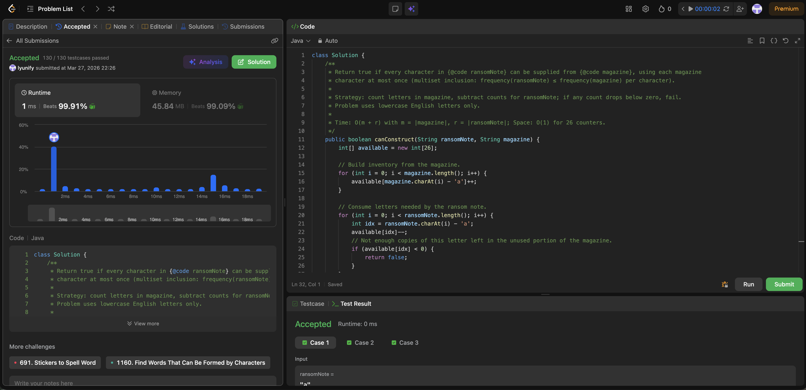

# 383. Ransom Note

**Difficulty**: Easy<br>
**Primary Tag**: hash-table<br>
**Secondary Tags**: string, counting<br>
**LeetCode Link**: https://leetcode.com/problems/ransom-note/

---

## Problem Summary

Given two strings `ransomNote` and `magazine`, return `true` if `ransomNote` can be constructed using the letters from `magazine` (each letter may only be used once).

## Screenshot



---

## My Mistake(s)

- Unsure how to track character frequencies efficiently.

### 2026-03-27

- **Confused "substring" with "multiset of letters".** The note does not have to appear as a contiguous substring of magazine; you only need enough copies of each letter. Any order in magazine is fine as long as frequencies cover the note.
- **Counted the wrong string first (or only one).** Building counts from ransomNote and then "adding from magazine" is error-prone; the robust pattern is inventory from magazine, then consume for ransomNote. Forgetting to decrement / using the wrong sign leads to wrong answers.
- **Off-by-one or wrong array size for alphabet.** The problem uses lowercase English letters only (a–z), so `int[26]` with index `c - 'a'` is correct; using length 128 or mixing uppercase without normalizing causes silent bugs.
- **Early exit missing or inverted.** You need `available[idx] < 0` after decrement to fail fast; checking `> 0` before decrement only, or returning true without verifying all letters, are logic slips.
- **Tried sorting both strings.** Sorting works in spirit but is O(n log n) and easy to mishandle when lengths differ; frequency counting is simpler and O(m + r) with O(1) extra space for 26 letters.
- **Double-counted or "reused" the same magazine index twice in logic.** Each character in magazine is one tile; the frequency approach enforces "use at most once per occurrence" automatically.

## Key Insight

Use a hash map to count the frequency of each character in the magazine, then decrement the counts while iterating through the ransom note. If a required character is missing or its count is already zero, return false. Otherwise, return true after processing all characters in the ransom note.

### 2026-03-27

- **Ransom note feasibility is vector inequality on letter counts:** for every letter `c`, `count_note(c) ≤ count_magazine(c)`. Equivalent: magazine's multiset contains the note's multiset (order irrelevant).
- **One-pass inventory + consumption:** increment counts while scanning magazine, decrement while scanning ransomNote; any negative bucket means "not enough letters left."
- **Complexity:** Time O(m + r) where m = |magazine|, r = |ransomNote|; Space O(1) with fixed 26 counters.

## Correct Approach

1. Build a frequency dictionary from `magazine`.
2. For each character in `ransomNote`, check if it exists in the dictionary with count > 0.
3. If yes, decrement its count. If no, return `False`.
4. Return `True` after all characters are matched.

```python
class Solution(object):
    def canConstruct(self, ransomNote, magazine):
        dictionary = {}  # Map each letter to how many copies we still have from the magazine.

        for char in magazine:  # Scan the whole magazine to build the available letter counts.
            if char not in dictionary:  # Letter seen for the first time.
                dictionary[char] = 1  # Start its available count at 1.
            else:
                dictionary[char] += 1  # Add one more available copy of this letter.

        for char in ransomNote:  # Walk each character required by the ransom note.
            if char in dictionary and dictionary[char] > 0:  # This letter exists and at least one copy is left.
                dictionary[char] -= 1  # Use up one copy toward building the note.
            else:
                return False  # Letter missing or already used up; cannot finish the note.

        return True  # All characters in ransomNote were successfully matched.
```

**Time Complexity**: O(m + n) where m and n are the lengths of magazine and ransomNote<br>
**Space Complexity**: O(1) (at most 26 lowercase letters in the map)

---

## Practice History

| Date | Outcome | Notes |
|------|---------|-------|
| 2026-03-22 | Solved after review | Unsure how to track character frequencies; used hash map to count magazine chars then decrement for ransom note |
| 2026-03-27 | Solved after review | Confused substring with multiset; wrong counting order; fixed-26 int array approach; feasibility = vector inequality on letter counts |
